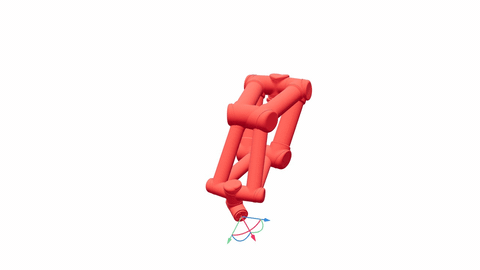
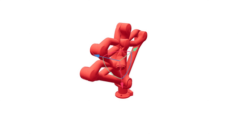
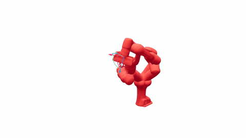
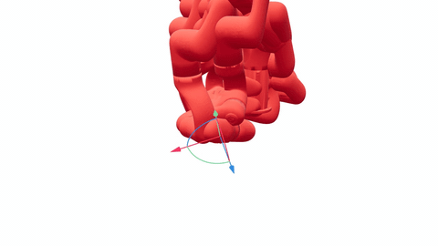
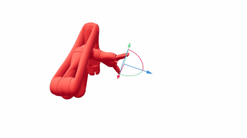
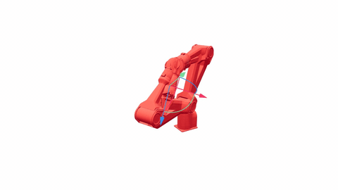
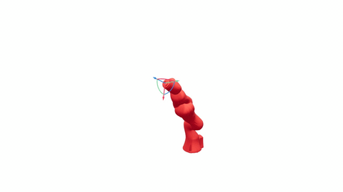
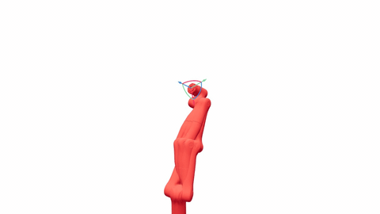

# ssik

[](https://pypi.org/project/ssik/)
[](https://pypi.org/project/ssik/)
[](LICENSE)
[](https://doi.org/10.5281/zenodo.20278005)

Analytical inverse kinematics for 6R and 7R revolute robot arms. Each arm becomes a single self-contained Python module that returns **every IK branch** with FK closure well below typical robot repeatability — and tightenable to machine precision when needed.

## Install

```bash
pip install ssik
```

Python 3.11+. Wheels for Linux x86_64, macOS arm64, macOS x86_64, Windows x86_64.

## Quickstart

```python
from ssik.prebuilt import franka_panda_ik
import numpy as np

T_target = np.eye(4); T_target[:3, 3] = [0.5, 0.1, 0.3]
sols = franka_panda_ik.solve(T_target)      # every analytical IK branch
```

`sols` is a `list[Solution]`. Each `Solution` carries `q` (the joint vector), `fk_residual` (‖FK(q) − T‖), and which polish path fired. Empty list = pose is unreachable.

### See every branch at once

```bash
pip install 'ssik[demo]'
python examples/05_viser_interactive_ik.py
```

Opens a browser viewer: drag a 3D handle and watch every analytical IK solution render as a live arm in real time. Cycle through the full prebuilt roster — including the non-Pieper 6R and 7R arms EAIK refuses.

#### Eight arms, every analytical branch

Each loop below is one arm's interactive demo running for ~3 seconds: the live red arm tracks the marker; the faded reds are the other analytical IK branches at the same instant. Captured from [`examples/05_viser_interactive_ik.py`](examples/05_viser_interactive_ik.py).

**UR5** — three-parallel 6R (Pieper). EAIK supports this class.



**Unitree Z1** — three-parallel 6R (UR-class). EAIK supports this class.



**Franka Panda** — anthropomorphic 7R. EAIK refuses ("only 1–6R").



**UFactory xArm6** — non-Pieper 6R. EAIK refuses ("6R-Unknown Kinematic Class").



**Kinova JACO 2** — non-Pieper 6R. EAIK refuses ("6R-Unknown Kinematic Class").



**AgileX PiPER** — non-Pieper 6R. EAIK refuses ("6R-Unknown Kinematic Class").



**KUKA iiwa14** — SRS 7R. EAIK refuses ("no 7R DH path").



**Flexiv Rizon 4** — non-SRS 7R. EAIK refuses ("only 1–6R").



## The artifact model

ssik is built around **per-arm artifact modules**. Each artifact is a single `.py` file with the per-arm KinBody constants, the dispatched solver, and any cached symbolic preprocessing already baked in. **No URDF parsing, no `urchin`, no `sympy` on the runtime import path.** A robot stack that imports `<arm>_ik.py` carries no algorithmic complexity beyond what the build pipeline already resolved.

This is the same idea OpenRAVE's IKFast had — generate per-arm specialised IK code at design time, run pure numeric at deployment — but without IKFast's brittleness on non-Pieper geometries.

There are two artifact paths:

### Use a prebuilt arm (`ssik.prebuilt`)

The wheel ships 19 ready-to-import artifacts. Each was built against a specific URDF (or extracted spec); `T_target` is the pose of `EE_LINK` expressed in `BASE_LINK`:

<!-- AUTOGEN:readme_prebuilt_table -->
| Module | Arm | Class | base_link | ee_link |
|---|---|---|---|---|
| `ur5_ik` | Universal Robots UR5 | three-parallel 6R | `base_link` | `ee_link` |
| `puma560_ik` | KUKA Puma 560 | Pieper 6R (spherical wrist) | `base_link` | `wrist_3_link` |
| `jaco2_ik` | Kinova JACO 2 | **non-Pieper 6R** | `base_link` | `ee_link` |
| `iiwa14_ik` | KUKA iiwa LBR 14 | SRS 7R | `base` | `iiwa_link_ee_kuka` |
| `gen3_ik` | Kinova Gen3 7-DOF | **approximate-SRS 7R** | `base_link` | `end_effector_link` |
| `franka_panda_ik` | Franka Panda | **anthropomorphic 7R** | `panda_link0` | `panda_link8` |
| `xarm7_ik` | UFactory xArm7 | **7R** (jointlock → `reversed:two_intersecting`) | `link_base` | `link7` |
| `xarm6_ik` | UFactory xArm6 | **non-Pieper 6R** (joint 6 y-offset) | `link_base` | `link_eef` |
| `z1_ik` | Unitree Z1 | three-parallel 6R (UR-class) | `link00` | `link06` |
| `piper_ik` | AgileX PiPER | **non-Pieper 6R** (joints 4 & 6 tilted axis) | `base_link` | `link6` |
| `rizon4_ik` | Flexiv Rizon 4 | **non-SRS 7R** | `base_link` | `flange` |
| `kassow_kr810_ik` | Kassow KR810 | **non-SRS 7R** | `base` | `end_effector` |
| `rizon10_ik` | Flexiv Rizon 10 | **non-SRS 7R** (~1.4 m reach) | `base_link` | `flange` |
| `fanuc_crx10ial_ik` | FANUC CRX-10iA/L | **non-Pieper 6R** (non-spherical wrist, 150 mm y-offset) | `base_link` | `tool0` |
| `yam_ik` | I2RT YAM | **non-Pieper 6R** | `base_link` | `link_6` |
| `big_yam_ik` | I2RT big_yam | **non-Pieper 6R** | `base` | `gripper` |
| `fr3_ik` | Franka Research 3 | **anthropomorphic 7R** (Panda successor) | `fr3_link0` | `fr3_link8` |
| `openarm_left_ik` | Enactic OpenArm v2.0 (left) | **non-SRS 7R** (axes concurrent, non-ZYZ wrist) | `openarm_left_base_link` | `openarm_left_ee_base_link` |
| `openarm_right_ik` | Enactic OpenArm v2.0 (right) | **non-SRS 7R** (axes concurrent, non-ZYZ wrist) | `openarm_right_base_link` | `openarm_right_ee_base_link` |
<!-- /AUTOGEN -->

```python
from ssik.prebuilt import iiwa14_ik
sols = iiwa14_ik.solve(T_target)
```

#### Where each fixture comes from

Each prebuilt's kinematic chain is sourced from a specific upstream URDF (or, for legacy DH arms, the published parameter set). The IK promise — "the q-vector lands a real arm at the target" — only holds when ssik's chain matches the manufacturer's. We lock this in with [`tests/test_prebuilt_fixture_parity.py`](tests/test_prebuilt_fixture_parity.py): for every arm whose source is reachable via `robot_descriptions`, it asserts `module.fk(q) == upstream.fk(q)` to machine precision.

<!-- AUTOGEN:readme_fixture_source_table -->
| Module | Fixture provenance |
|---|---|
| `ur5_ik` | robot_descriptions / ur5_description |
| `puma560_ik` | classical DH (Lee, Asada & Slotine 1986) |
| `jaco2_ik` | Kinova j2n6s200 DH (kinova-ros / kinova_description) |
| `iiwa14_ik` | robot_descriptions / iiwa14_description |
| `gen3_ik` | Kinovarobotics / ros_kortex (kortex_description / gen3.xacro) |
| `franka_panda_ik` | robot_descriptions / panda_description |
| `xarm7_ik` | robot_descriptions / xarm7_description |
| `xarm6_ik` | robot_descriptions / xarm6_description |
| `z1_ik` | robot_descriptions / z1_description |
| `piper_ik` | robot_descriptions / piper_description |
| `rizon4_ik` | robot_descriptions / rizon4_description |
| `kassow_kr810_ik` | Kassow KR810 URDF (vendor-supplied) |
| `rizon10_ik` | Flexiv Rizon 10 URDF (vendor-supplied) |
| `fanuc_crx10ial_ik` | ros-industrial / fanuc_crx10ia_support |
| `yam_ik` | robot_descriptions / yam_description |
| `big_yam_ik` | i2rt-robotics / i2rt |
| `fr3_ik` | robot_descriptions / fr3_description |
| `openarm_left_ik` | enactic / openarm_description |
| `openarm_right_ik` | enactic / openarm_description |
<!-- /AUTOGEN -->

Every prebuilt exposes `BASE_LINK`, `EE_LINK`, `DOF`, and `T_HOME` (the 4×4 home pose, FK at `q = np.zeros(DOF)`) as module constants. Use them to verify the baked geometry matches your robot:

```python
from ssik.prebuilt import franka_panda_ik
print(franka_panda_ik.BASE_LINK, "→", franka_panda_ik.EE_LINK, "(", franka_panda_ik.DOF, "DOF)")
# base_link → ee_link ( 7 DOF)
print(franka_panda_ik.T_HOME[:3, 3])
# array([0.088, 0., 0.926])     ← Franka home pose; matches the spec
```

### When a prebuilt is right vs when to `ssik build`

The prebuilts cover **nominal manufacturer geometry with a bare flange**. They work when:

- You're using the same URDF source we built against (ros-industrial, manufacturer reference, etc.)
- Your robot's calibration matches the nominal kinematic parameters
- Your end-effector is the flange itself — no gripper, suction cup, or custom tool past it
- Your URDF link names match what we baked (see the table above)

If **any** of those is false — and especially if you're a 7R arm with anything attached past the flange — build your own:

```bash
pip install ssik[urdf]
ssik build <your.urdf> --base <your_base_link> --ee <your_actual_tool_link>
# → <your_arm>_ik.py
```

`ssik build` reads your exact URDF, picks the right solver via the same dispatcher we use, and emits a single-file artifact correct for your kinematic chain. That artifact's import / API / public constants are identical to the prebuilts'.

For trajectory tracking and IK-based teleop, the canonical pattern is "give me the IK closest to where the robot is now":

```python
# Robot's current configuration (from joint sensors, last command, etc.).
q_current = np.array([0.0, -0.5, 0.0, 0.7, 0.0, 1.2, 0.0])

# Target pose updates every control tick (VR controller, planner, etc.).
T_target = ...

# max_solutions=1 + q_seed: returns the single solution nearest q_current.
# On 7R jointlock arms the seed drives the lock-outward fast path (~20×
# faster than the full sweep); sub-ms on 6R / SRS arms.
sols = franka_panda_ik.solve(T_target, max_solutions=1, q_seed=q_current)
q_command = sols[0].q if sols else q_current
```

When a seed is given, two knobs control what "nearest" means:

- **`seed_metric`** (default `"wrap_linf"`) ranks by the *largest* single-joint move, so the arm holds its branch instead of flipping mid-trajectory; `"wrap_l2"` ranks by summed distance.
- **`seed_tolerance`** (radians) is a *hard* bound — only solutions whose every joint is within the tolerance of the seed are returned. The result may be **empty**, which is the signal that smooth continuation isn't possible at this pose (replan / accept a jump). Omitted ⇒ best-effort (always returns the nearest if any IK exists).

```python
# "no joint jumps more than 6° from where I am, or tell me it can't":
sols = franka_panda_ik.solve(
    T_target, q_seed=q_current, max_solutions=1, seed_tolerance=np.deg2rad(6)
)
q_command = sols[0].q if sols else replan()   # empty ⇒ discontinuity
```

### Build an artifact for your own arm

For any arm not in the prebuilt set, run `ssik build` once against the URDF:

```bash
ssik build my_arm.urdf --base base_link --ee tool0
# → my_arm_ik.py
```

Build time depends on solver class:
- **<1 s** for tier-0 closed-form (UR-class, Pieper, SRS-class 7R)
- **~30 s** for non-Pieper 6R (Raghavan–Roth symbolic derivation)
- **7–20 min** for non-SRS 7R (cached Husty–Pfurner per lock sample)

Ship the emitted `.py` alongside your robot stack. Once built, use it exactly like a prebuilt:

```python
import my_arm_ik
sols = my_arm_ik.solve(T_target)
```

Re-run `ssik build` after `pip install -U ssik` if you want the latest solver fixes. Old artifacts keep working — they're frozen against the ssik version that built them. `ssik build` requires the URDF extras: `pip install ssik[urdf]`.

### Development path: `Manipulator.from_urdf` (not for deployment)

For one-off experiments before committing to a build artifact, ssik also exposes the runtime classifier as a Python class:

```python
import ssik
arm = ssik.Manipulator.from_urdf("my_arm.urdf", base="base_link", ee="tool0")
sols = arm.solve(T_target, max_solutions=1, q_seed=q_current)
```

Every fresh process re-runs URDF parsing, topology classification, and (for non-Pieper sub-chains) first-call sympy preprocessing — so this path is **strictly slower than the build-artifact path in production** and requires `urchin` + `sympy` on the runtime path (`pip install ssik[urdf]`). Once dispatch is settled, switch to `ssik build`.

Contributors extending ssik's own test fixtures (vs deploying for their own arm) use `ssik add-arm`; see [CONTRIBUTING.md](CONTRIBUTING.md#adding-a-new-arm-fixture).

## What `solve()` returns

A `list[Solution]`. Each `Solution` has:

- `q` — joint-angle vector (length DOF)
- `fk_residual` — `‖FK(q) − T‖_F` (Frobenius norm against the original URDF / spec FK)
- `refinement_used` — `"none"` or `"lm"` if Levenberg–Marquardt polish fired

A single 6-DOF target pose admits up to **16 analytical IK branches** (8 typical for a Pieper-class arm: 4 shoulder × 2 elbow, with the wrist deterministic). For 7R redundant arms the IK is a 1-parameter family; ssik discretises it into 32–256 branches per pose depending on the swivel-sample count.

By default `solve()` runs **`respect_limits=True`**: out-of-URDF-limit branches are dropped (with a `q ± 2π` rescue pass first). On 7R jointlock arms the limits filter runs *during* the lock-sweep so `max_solutions=1` short-circuits on the first in-limits candidate rather than wasting samples on branches the postprocess would discard. Pass `respect_limits=False` for the raw geometric set.

The `allow_refinement=True` opt-in runs LM polish per algebraic candidate at a few hundred microseconds per branch — useful when an algebraic candidate lands just above `fk_atol` near a kinematic singularity.

### Diagnosing an empty result — `explain=True`

If `solve()` returns `[]`, you can attribute the failure with `explain=True` instead of guessing:

```python
import ssik
arm = ssik.Manipulator.from_urdf("my_arm.urdf", base="base_link", ee="tool0")
sols, diag = arm.solve(T_target, explain=True)
if not sols:
    print(diag.summary())
    # solver: ikgeo.three_parallel (tier 0)
    # dispatch: Three consecutive parallel axes at joints (1, 2, 3) ...
    #   -> 0 raw candidates: pose appears unreachable
    #      (or outside this solver's analytical envelope)
```

The `Diagnostic` record distinguishes:
- **Unreachable** (`raw_candidates == 0`) — pose is outside the solver's analytical envelope
- **All-filtered** (`raw_candidates > 0`, `final_count == 0`) — try `respect_limits=False` for the raw geometric set
- **Capped** (`dropped_by_max_solutions > 0`) — pass a larger `max_solutions`

Available on `ssik.Manipulator.solve` today; per-prebuilt explain mode tracked in [#265](https://github.com/personalrobotics/ssik/issues/265).

## Tuning knobs

### `TolerancePolicy` — six thresholds, one object

`solve()` accepts an optional `policy=` kwarg. The default `ssik.DEFAULT_TOLERANCE_POLICY` works for every shipped fixture; reach for a custom policy when a real arm's URDF has structural near-degeneracies (axes that *almost* but not exactly meet) or when you want tighter / looser FK closure than the defaults provide.

```python
from ssik import TolerancePolicy, DEFAULT_TOLERANCE_POLICY

policy = TolerancePolicy(
    axis_parallel=1e-8,         # ||a × b||: when two axes are "parallel"
    axis_intersect=1e-8,        # perpendicular distance: when two lines "meet"
    subproblem_feasibility=1e-9,# is_ls boundary inside SP1-SP6
    subproblem_numerical=1e-5,  # FK-closure filter on algebraic candidates
    subproblem_degeneracy=1e-12,# rank-drop threshold; below this, return []
    subproblem_dedup=1e-3,      # angle-space tolerance for collapsing duplicates
)
sols = my_arm_ik.solve(T_target, policy=policy)
```

The fields are named for *why* they exist so log messages can say `"SP6 sign branch rejected: closure 1.2e-4 > subproblem_numerical 1e-5"` instead of citing magic numbers.

#### How to read `fk_residual` — and how to tighten it

`fk_residual` is `‖FK(q) − T_target‖_F` — a Frobenius norm of a 4×4 SE(3) matrix mixing rotation (radians, dimensionless when small) and translation (meters). For a typical 1 m-reach arm:

| `fk_residual` | Position-error scale | Note |
|---|---|---|
| 1e-3 | 1 mm | visible to the naked eye |
| 1e-4 | 0.1 mm | typical robot **repeatability** (manufacturer spec) |
| **1e-5 (default)** | **10 µm** | sub-repeatability; fine for control |
| 1e-9 | 1 nm | math / analysis territory |
| 1e-13 | 0.1 pm | float64 epsilon |

The default `subproblem_numerical = 1e-5` is intentionally pragmatic — **already two orders below what any physical robot can mechanically repeat**, but cheap enough that all prebuilts hit it without LM polish. Most control / planning users want exactly this default.

**To get machine precision** (RL training, differentiable IK, sample-based planning, math validation), opt in:

```python
from ssik import TolerancePolicy
from ssik.prebuilt import franka_panda_ik

tight = TolerancePolicy(
    axis_parallel=1e-8,
    axis_intersect=1e-8,
    subproblem_feasibility=1e-9,
    subproblem_numerical=1e-9,         # ← 4 orders tighter
    subproblem_degeneracy=1e-12,
    subproblem_dedup=1e-3,
)
sols = franka_panda_ik.solve(T_target, policy=tight, allow_refinement=True)
# every returned IK FK-closes ~3e-10 (~0.3 nm position error)
```

The `allow_refinement=True` flag engages Levenberg-Marquardt polish on candidates that don't meet `subproblem_numerical`. On the jointlock 7R arms (Franka, Rizon 4, Kassow KR810) this lifts worst-case FK from ~5×10⁻⁶ (default) to ~3×10⁻¹⁰ (tight + LM). Cost: a few hundred microseconds per polished candidate. Sub-repeatability arms (UR5, Puma 560, JACO 2, iiwa14, Gen3) already hit machine precision at the default policy and don't need the opt-in.

Per-arm worst-case behaviour under both policies is documented in [`docs/arm_coverage.md`](docs/arm_coverage.md#worst-case-fk-floor-under-adversarial-fuzz).

### `ssik.postprocess` — composable filters

`solve()` returns the geometric IK set. For application-specific filtering, five helpers in `ssik.postprocess` compose into the typical "robot-aware IK" pipeline:

```python
from ssik.postprocess import (
    respect_limits, wrap_to_limits, nearest_to_seed, within_seed_tolerance, take_first,
)

sols = my_arm_ik.solve(T_target, respect_limits=False)       # raw geometric set
sols = wrap_to_limits(sols, my_arm_ik._KB)                   # try q ± 2π to bring in
sols = respect_limits(sols, my_arm_ik._KB)                   # drop anything still outside
sols = within_seed_tolerance(sols, q_current, np.deg2rad(6)) # drop big-jump branches (may empty)
sols = nearest_to_seed(sols, q_current, metric="wrap_linf")  # rank by max-joint-move
sols = take_first(sols, k=4)                                 # top-k after ranking
```

By default `solve()` already runs `wrap_to_limits` + `respect_limits` (and, when `q_seed`/`seed_tolerance`/`seed_metric` are passed, the seed filter + ranking); the standalone helpers exist for callers who want a different order, a different metric, or to add their own filters (collision-aware filtering, dexterity scoring) between the layers.

Out of scope: collision filtering (use FCL or similar at the application layer) and continuous-trajectory smoothness (typically a separate planner concern).

## How it compares

Numerical-IK libraries take a seed, run damped least-squares to a **single** converged configuration, and stop. ssik returns **every analytical branch** — with FK closure well below typical robot repeatability by default, tightenable to machine precision (see [Tuning knobs](#tuning-knobs) below). Branch enumeration matters for motion planning (try every branch, pick the one with best clearance), for dexterity analysis (the manipulability ellipsoid is per-branch), and for trajectory continuation across kinematic singularities.

EAIK (Ostermeier 2024) is the canonical Python wrapper around C++ subproblem-decomposition solvers. It's analytical on the kinematic families it recognises and refuses everything else. Numbers below from [`examples/04_compare_vs_eaik.py`](examples/04_compare_vs_eaik.py) over 100 random reachable poses per arm, Apple M3 single-thread, mean ± 95% CI via 1000-resample bootstrap. FK residual is the Frobenius norm `‖FK(q) − T‖` against the original URDF / spec FK.

<!-- AUTOGEN:readme_eaik_table -->
| Arm (class) | EAIK | ssik |
|---|---|---|
| UR5 (Pieper 6R, three-parallel) | 5 ± 0 µs / FK 2e-15 / 2-8 sols | 521 ± 12 µs / FK 6e-12 / 2-8 sols |
| Puma 560 (Pieper 6R, spherical wrist) | 5 ± 0 µs / FK 3e-14 / 8 sols | 220 ± 3 µs / FK 2e-14 / 8 sols |
| JACO 2 (**non-Pieper 6R**) | **refuses** ("6R-Unknown Kinematic Class") | 976 ± 39 µs / FK 5e-6 / 2-12 sols |
| iiwa14 (SRS 7R) | **refuses** ("only 1-6R") | 4.83 ± 0.11 ms / FK 5e-13 / 128 sols |
| Gen3 (**approximate-SRS 7R**, 12 mm offset) | **refuses** ("only 1-6R") | 41.46 ± 1.25 ms / FK 1e-12 / 10-95 sols |
| Franka Panda (**anthropomorphic 7R**) | **refuses** ("only 1-6R") | 29.57 ± 2.95 ms / FK 1e-6 / 8-124 sols |
| xArm7 (**non-SRS 7R**) | **refuses** ("only 1-6R") | 37.10 ± 0.49 ms / FK 4e-11 / 56-64 sols |
| xArm6 (**non-Pieper 6R**) | **refuses** ("6R-Unknown Kinematic Class") | 1.06 ± 0.02 ms / FK 2e-7 / 8-12 sols |
| Z1 (Pieper 6R, three-parallel) | 5 ± 0 µs / FK 1e-15 / 4-8 sols | 487 ± 7 µs / FK 3e-15 / 4-8 sols |
| PiPER (**non-Pieper 6R**) | **refuses** ("6R-Unknown Kinematic Class") | 1.10 ± 0.03 ms / FK 1e-5 / 1-8 sols |
| Rizon 4 (**non-SRS 7R**) | **refuses** ("only 1-6R") | 16.57 ± 0.30 ms / FK 4e-9 / 10-60 sols |
| Kassow KR810 (**non-SRS 7R**) | **refuses** ("only 1-6R") | 17.62 ± 0.29 ms / FK 7e-8 / 10-38 sols |
| Rizon 10 (**non-SRS 7R**) | **refuses** ("only 1-6R") | 16.26 ± 0.34 ms / FK 6e-8 / 10-64 sols |
| CRX-10iA/L (**non-Pieper 6R**) | **refuses** ("6R-Unknown Kinematic Class") | 991 ± 14 µs / FK 6e-7 / 6-12 sols |
| YAM (**non-Pieper 6R**) | **refuses** ("6R-Unknown Kinematic Class") | 1.08 ± 0.02 ms / FK 8e-9 / 8 sols |
| big_yam (**non-Pieper 6R**) | **refuses** ("6R-Unknown Kinematic Class") | 1.03 ± 0.02 ms / FK 5e-6 / 8 sols |
| FR3 (**anthropomorphic 7R**) | **refuses** ("only 1-6R") | 30.83 ± 3.12 ms / FK 6e-9 / 8-128 sols |
| OpenArm L (**non-SRS 7R**) | **refuses** ("only 1-6R") | 13.41 ± 1.56 ms / FK 2e-15 / 8-40 sols |
| OpenArm R (**non-SRS 7R**) | **refuses** ("only 1-6R") | 11.07 ± 0.82 ms / FK 1e-15 / 8-40 sols |
<!-- /AUTOGEN -->

The "sols" column shows the **range of branch counts across the 100 reachable poses**. For Pieper-class arms (Puma) the count is constant (8); for non-Pieper 6R the count varies because spurious roots of the degree-8 Sylvester resultant fall complex at some poses. For 7R arms the count is the **discretised redundancy-manifold sample × algebraic-branch product** — e.g. iiwa14's 16-sample swivel × 8 branches per sample = 128 sols. EAIK is ~100× faster than ssik on Pieper-class 6R — that is its native sweet spot, and ssik does not try to compete there. The interesting cells are the **refuses** ones: non-Pieper 6R (JACO 2, xArm6, PiPER) and every 7R arm. Those are the geometries ssik exists for. The "refuses (...)" strings: quoted ones (`"only 1-6R"`) are EAIK's actual error captured verbatim from its URDF loader; `(no 7R DH path...)` rows are spec-only fixtures whose 7-joint chain can't pass through our DH-extraction adapter into EAIK's `IK_DH` API — EAIK refuses the same arms either way (its URDF loader returns "only 1-6R" on every 7R input). A numerical-IK comparison (MINK) is tracked separately in [#236](https://github.com/personalrobotics/ssik/issues/236).

## Under the hood

The algorithmic ingredients are not novel — Raghavan–Roth (1990), Manocha–Canny (1994), Singh–Kreutz (1989), Husty–Pfurner (2007). What's new is making the textbook pipelines survive on real ill-conditioned arms (AE-3 leftvar selection on JACO 2 drops `cond(m_quad)` from 3.75 × 10^16 to 127), composing them with a uniform dispatch layer, and packaging the whole thing as a deployable artifact.

Cython hot loops cover the leaf primitives (POE forward kinematics, the Levenberg–Marquardt polish and analytical Jacobian); the rest is pure Python so it stays inspectable.

**Bulletproof testing**: every solver lands with N-way cross-solver agreement on shared fixtures, FK closure ≤ 1e-10 on every retained IK, 500+ Hypothesis-fuzzed random poses per fixture, and an explicit speed bench that has to clear a regression gate. The current suite has **1300+ tests across 11 fixture arms**. Negative-result spikes (a Cython estimate that misses by 2-5×, a codegen-bake on a part that's 0.3% of runtime) are published as closed issues with profile data so the next contributor doesn't repeat the path.

## Documentation

Full docs site: **<https://personalrobotics.github.io/ssik/>**

- [Quickstart](https://personalrobotics.github.io/ssik/quickstart/) — install, prebuilts, trajectory tracking, explain mode
- [Setting up your robot](https://personalrobotics.github.io/ssik/setting_up_your_robot/) — URDF readiness, `--base`/`--ee` selection, tool baking, verification
- [Arm coverage](https://personalrobotics.github.io/ssik/arm_coverage/) — per-arm fixtures, speeds, FK floors
- [Architecture](https://personalrobotics.github.io/ssik/architecture/) — solver tier catalog, dispatch flow, algorithmic lineage
- [API reference](https://personalrobotics.github.io/ssik/api/) — `Manipulator`, `Solution`, `Diagnostic`, `TolerancePolicy`
- [Semver policy](https://personalrobotics.github.io/ssik/semver_policy/) — what's public, what counts as breaking
- [CONTRIBUTING.md](CONTRIBUTING.md) — repo layout, dev setup, testing discipline

## Related libraries

ssik does not compete with these on the arms they cover. Pick the right tool for your geometry.

- [**EAIK**](https://github.com/OstermD/EAIK) (Ostermeier 2024) — Python wrapper around C++ subproblem-decomposition solvers. Analytical, returns all branches on Pieper-class 6R and canonical SRS 7R (with a manual joint lock). Refuses arms outside its recognised kinematic families. Directly benchmarked in the table above.
- [**IK-Geo**](https://github.com/rpiRobotics/ik-geo) (Elias–Wen 2022/2025) — the reference C++/Rust implementation of subproblem decomposition. Same coverage profile as EAIK. Has Python bindings (`ik-geo` on PyPI); currently pins `pyo3==0.20.3` so the wheel is incompatible with Python 3.13 — track upstream for an update.
- [**IKFast**](http://openrave.org/docs/latest_stable/openravepy/ikfast/) (Diankov 2010, part of OpenRAVE) — the original analytical-IK codegen tool. Symbolic preprocessing in sympy → per-arm C++. Works well on the kinematic families it was tuned for (Pieper-class 6R, spherical-wrist 7R via joint lock); the symbolic pipeline fails on modern sympy for non-Pieper geometries (`mpmath.polyroots` NoConvergence, `Matrix.inv` / `Matrix.det` stalls). LGPL-licensed.
- [**MINK**](https://github.com/kevinzakka/mink) (Zakka) — Mujoco-native numerical IK via damped least-squares. Iterative, takes a seed, converges to a single configuration. Handles any kinematic geometry but returns one IK, not all branches, and FK closure is proportional to the convergence tolerance (typically 1e-3 to 1e-6 rather than machine precision).
- [**TracIK**](https://traclabs.com/projects/trac-ik/) (Beeson & Ames 2015) — combined SQP / pseudoinverse Jacobian solver; the ROS Industrial default numerical IK. URDF-native. Same one-branch-per-seed semantics as MINK. The maintained Python binding (`pytracik`) ships a broken arm64 wheel; the ROS-native binding works fine inside ROS.
- [**KDL-LMA**](https://github.com/orocos/orocos_kinematics_dynamics) — OROCOS KDL's Levenberg-Marquardt numerical IK. Older and less robust than TracIK or MINK on the same problem class.

## License

[BSD-3-Clause](LICENSE). The library incorporates clean-room reimplementations of algorithms from BSD-3-licensed IK-Geo (Elias–Wen 2022/2025) and from the academic publications of Raghavan–Roth (1990), Manocha–Canny (1994), Singh–Kreutz (1989), and Husty–Pfurner (2007). Algorithmic lineage is documented in module docstrings.

## Citation

If you use ssik in academic work, please cite it. Machine-readable metadata is in [`CITATION.cff`](CITATION.cff); GitHub renders that as a "Cite this repository" button on the repo sidebar.

```bibtex
@software{ssik,
  author    = {Srinivasa, Siddhartha},
  title     = {ssik: analytical inverse kinematics for 6R and 7R revolute arms},
  url       = {https://github.com/personalrobotics/ssik},
  doi       = {10.5281/zenodo.20278005},
  year      = {2026},
  publisher = {Zenodo},
}
```
