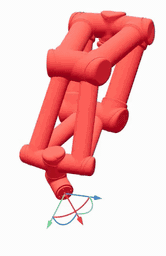
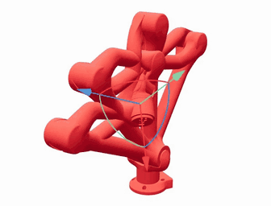
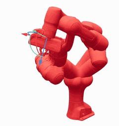
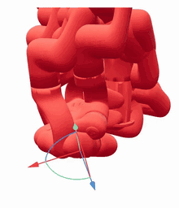
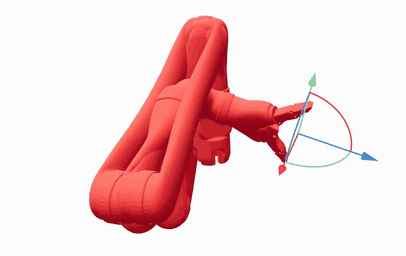
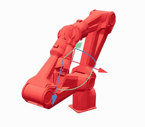
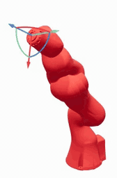
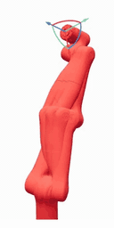
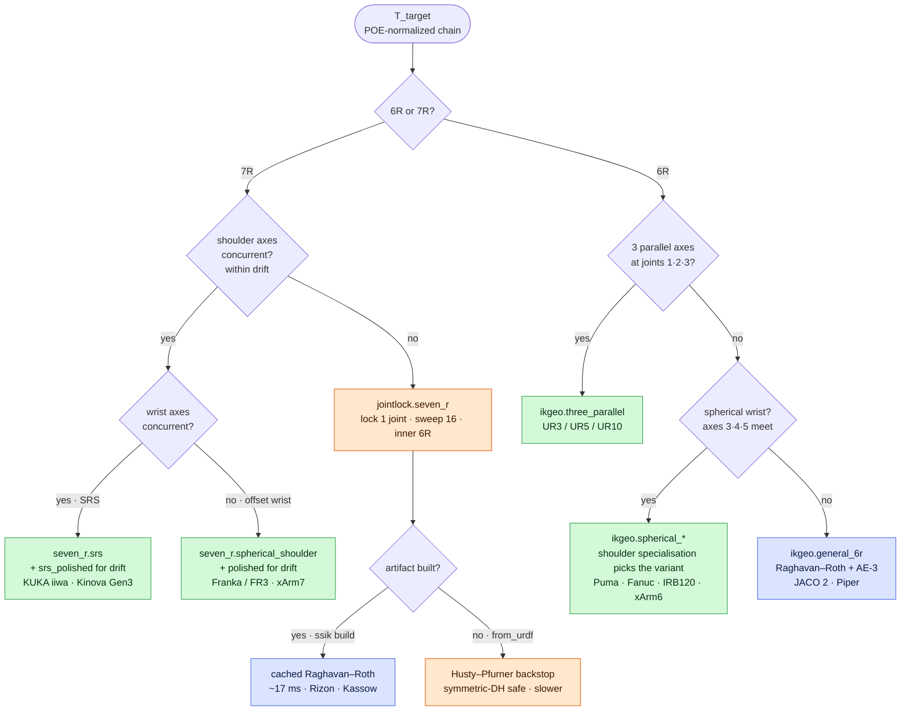
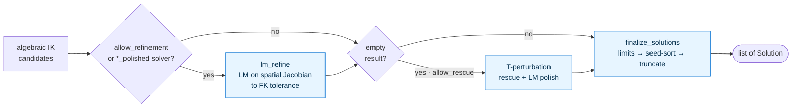

# ssik

[](https://pypi.org/project/ssik/)
[](https://pypi.org/project/ssik/)
[](LICENSE)
[](https://doi.org/10.5281/zenodo.20278005)

Analytical inverse kinematics for 6R and 7R revolute robot arms. Each arm becomes a single self-contained Python module that returns **every IK branch** with FK closure well below typical robot repeatability, and tightenable to machine precision when needed.

## Install

```bash
pip install ssik
```

Python 3.11+. Wheels for Linux x86_64, macOS arm64, macOS x86_64, Windows x86_64.

## Quickstart

```python
from ssik.prebuilt import franka_panda_ik
import numpy as np

T_target = np.eye(4); T_target[:3, 3] = [0.5, 0.1, 0.3]
sols = franka_panda_ik.solve(T_target)      # every analytical IK branch
```

`sols` is a `list[Solution]`. Each `Solution` carries `q` (the joint vector), `fk_residual` (‖FK(q) − T‖), and which polish path fired. Empty list = pose is unreachable.

### See every branch at once

```bash
pip install 'ssik[demo]'
python examples/05_viser_interactive_ik.py
```

Opens a browser viewer: drag a 3D handle and watch every analytical IK solution render as a live arm in real time. Cycle through the full prebuilt roster, including the non-Pieper 6R and 7R arms EAIK refuses.

#### Eight arms, every analytical branch

Each loop below is one arm's interactive demo running for ~3 seconds: the live red arm tracks the marker; the faded reds are the other analytical IK branches at the same instant. Captured from [`examples/05_viser_interactive_ik.py`](examples/05_viser_interactive_ik.py).

**UR5**: three-parallel 6R (Pieper). EAIK supports this class.



**Unitree Z1**: three-parallel 6R (UR-class). EAIK supports this class.



**Franka Panda**: anthropomorphic 7R. EAIK refuses ("only 1–6R").



**UFactory xArm6**: non-Pieper 6R. EAIK refuses ("6R-Unknown Kinematic Class").



**Kinova JACO 2**: non-Pieper 6R. EAIK refuses ("6R-Unknown Kinematic Class").



**AgileX PiPER**: non-Pieper 6R. EAIK refuses ("6R-Unknown Kinematic Class").



**KUKA iiwa14**: SRS 7R. EAIK refuses ("no 7R DH path").



**Flexiv Rizon 4**: non-SRS 7R. EAIK refuses ("only 1–6R").



## The artifact model

ssik is built around **per-arm artifact modules**. Each artifact is a single `.py` file with the per-arm KinBody constants, the dispatched solver, and any cached symbolic preprocessing already baked in. **No URDF parsing, no `urchin`, no `sympy` on the runtime import path.** A robot stack that imports `<arm>_ik.py` carries no algorithmic complexity beyond what the build pipeline already resolved.

This is the same idea OpenRAVE's IKFast had (generate per-arm specialised IK code at design time, run pure numeric at deployment) but without IKFast's brittleness on non-Pieper geometries.

There are two artifact paths:

### Use a prebuilt arm (`ssik.prebuilt`)

The wheel ships <!-- AUTOGEN:arm_count -->72<!-- /AUTOGEN --> ready-to-import artifacts, grouped by vendor below (expand a vendor to see its arms). Each imports as `ssik.prebuilt.<vendor>.<module>` (e.g. `from ssik.prebuilt.universal_robots import ur5_ik`) and the flat `from ssik.prebuilt import ur5_ik` alias still works. Each was built against a specific URDF (or extracted spec); `T_target` is the pose of `EE_LINK` expressed in `BASE_LINK`:

<!-- AUTOGEN:readme_prebuilt_table -->
<details>
<summary><b>Universal Robots</b>: <code>ssik.prebuilt.universal_robots</code> (11 arms)</summary>

| Module | Arm | Class | base_link | ee_link |
|---|---|---|---|---|
| `ur5_ik` | Universal Robots UR5 | three-parallel 6R | `base_link` | `ee_link` |
| `ur3e_ik` | Universal Robots UR3e | three-parallel 6R | `base_link` | `tool0` |
| `ur5e_ik` | Universal Robots UR5e | three-parallel 6R | `base_link` | `tool0` |
| `ur10e_ik` | Universal Robots UR10e | three-parallel 6R | `base_link` | `tool0` |
| `ur16e_ik` | Universal Robots UR16e | three-parallel 6R | `base_link` | `tool0` |
| `ur20_ik` | Universal Robots UR20 | three-parallel 6R | `base_link` | `tool0` |
| `ur30_ik` | Universal Robots UR30 | three-parallel 6R | `base_link` | `tool0` |
| `ur7e_ik` | Universal Robots UR7E | three-parallel 6R | `base_link` | `tool0` |
| `ur12e_ik` | Universal Robots UR12E | three-parallel 6R | `base_link` | `tool0` |
| `ur15_ik` | Universal Robots UR15 | three-parallel 6R | `base_link` | `tool0` |
| `ur18_ik` | Universal Robots UR18 | three-parallel 6R | `base_link` | `tool0` |

</details>

<details>
<summary><b>Unimation</b>: <code>ssik.prebuilt.unimation</code> (1 arm)</summary>

| Module | Arm | Class | base_link | ee_link |
|---|---|---|---|---|
| `puma560_ik` | KUKA Puma 560 | Pieper 6R (spherical wrist) | `base_link` | `wrist_3_link` |

</details>

<details>
<summary><b>Kinova</b>: <code>ssik.prebuilt.kinova</code> (5 arms)</summary>

| Module | Arm | Class | base_link | ee_link |
|---|---|---|---|---|
| `jaco2_ik` | Kinova JACO 2 | **non-Pieper 6R** | `base_link` | `ee_link` |
| `gen3_ik` | Kinova Gen3 7-DOF | **approximate-SRS 7R** | `base_link` | `end_effector_link` |
| `gen3_lite_ik` | Kinova Gen3 Lite | **non-Pieper 6R** | `base_link` | `end_effector_link` |
| `j2s6s300_ik` | Kinova JACO j2s6s300 | Pieper 6R (spherical wrist) | `j2s6s300_link_base` | `j2s6s300_end_effector` |
| `j2s7s300_ik` | Kinova JACO j2s7s300 | **approximate-SRS 7R** (spherical wrist) | `j2s7s300_link_base` | `j2s7s300_link_7` |

</details>

<details>
<summary><b>KUKA</b>: <code>ssik.prebuilt.kuka</code> (4 arms)</summary>

| Module | Arm | Class | base_link | ee_link |
|---|---|---|---|---|
| `iiwa14_ik` | KUKA iiwa LBR 14 | SRS 7R | `base` | `iiwa_link_ee_kuka` |
| `iiwa7_ik` | KUKA iiwa LBR 7 | SRS 7R (offset wrist) | `iiwa_link_0` | `iiwa_link_ee` |
| `kr6_r900_ik` | KUKA KR 6 R900 sixx (Agilus) | Pieper 6R (spherical wrist) | `base_link` | `link_6` |
| `kr210_r2700_ik` | KUKA KR 210 R2700 (Quantec) | Pieper 6R (spherical wrist) | `base_link` | `link_6` |

</details>

<details>
<summary><b>Franka</b>: <code>ssik.prebuilt.franka</code> (2 arms)</summary>

| Module | Arm | Class | base_link | ee_link |
|---|---|---|---|---|
| `panda_ik` | Franka Panda | **spherical-shoulder + offset-wrist 7R** | `panda_link0` | `panda_link8` |
| `fr3_ik` | Franka Research 3 | **spherical-shoulder + offset-wrist 7R** (Panda successor) | `fr3_link0` | `fr3_link8` |

</details>

<details>
<summary><b>UFactory</b>: <code>ssik.prebuilt.ufactory</code> (2 arms)</summary>

| Module | Arm | Class | base_link | ee_link |
|---|---|---|---|---|
| `xarm7_ik` | UFactory xArm7 | **approximately-spherical-shoulder 7R** | `link_base` | `link7` |
| `xarm6_ik` | UFactory xArm6 | **non-Pieper 6R** (joint 6 y-offset) | `link_base` | `link_eef` |

</details>

<details>
<summary><b>Unitree</b>: <code>ssik.prebuilt.unitree</code> (1 arm)</summary>

| Module | Arm | Class | base_link | ee_link |
|---|---|---|---|---|
| `z1_ik` | Unitree Z1 | three-parallel 6R (UR-class) | `link00` | `link06` |

</details>

<details>
<summary><b>AgileX</b>: <code>ssik.prebuilt.agilex</code> (1 arm)</summary>

| Module | Arm | Class | base_link | ee_link |
|---|---|---|---|---|
| `piper_ik` | AgileX PiPER | **non-Pieper 6R** (joints 4 & 6 tilted axis) | `base_link` | `link6` |

</details>

<details>
<summary><b>Flexiv</b>: <code>ssik.prebuilt.flexiv</code> (2 arms)</summary>

| Module | Arm | Class | base_link | ee_link |
|---|---|---|---|---|
| `rizon4_ik` | Flexiv Rizon 4 | **non-SRS 7R** | `base_link` | `flange` |
| `rizon10_ik` | Flexiv Rizon 10 | **non-SRS 7R** (~1.4 m reach) | `base_link` | `flange` |

</details>

<details>
<summary><b>Kassow</b>: <code>ssik.prebuilt.kassow</code> (1 arm)</summary>

| Module | Arm | Class | base_link | ee_link |
|---|---|---|---|---|
| `kr810_ik` | Kassow KR810 | **non-SRS 7R** | `base` | `end_effector` |

</details>

<details>
<summary><b>FANUC</b>: <code>ssik.prebuilt.fanuc</code> (10 arms)</summary>

| Module | Arm | Class | base_link | ee_link |
|---|---|---|---|---|
| `crx3ia_ik` | FANUC CRX-3iA | **non-Pieper 6R** (non-spherical wrist) | `base_link` | `tool0` |
| `crx5ia_ik` | FANUC CRX-5iA | **non-Pieper 6R** (non-spherical wrist) | `base_link` | `tool0` |
| `crx10ia_ik` | FANUC CRX-10iA | **non-Pieper 6R** (non-spherical wrist) | `base_link` | `tool0` |
| `crx10ialp_ik` | FANUC CRX-10iA/LP | **non-Pieper 6R** (non-spherical wrist) | `base_link` | `tool0` |
| `crx20ial_ik` | FANUC CRX-20iA/L | **non-Pieper 6R** (non-spherical wrist) | `base_link` | `tool0` |
| `crx30ia_ik` | FANUC CRX-30iA | **non-Pieper 6R** (non-spherical wrist) | `base_link` | `tool0` |
| `crx10ial_ik` | FANUC CRX-10iA/L | **non-Pieper 6R** (non-spherical wrist, 150 mm y-offset) | `base_link` | `tool0` |
| `m710ic_ik` | FANUC M-710iC/70 | Pieper 6R (spherical wrist) | `base_link` | `link_6` |
| `lrmate200id_ik` | FANUC LR Mate 200iD | Pieper 6R (spherical wrist) | `base_link` | `link_6` |
| `r2000ic210l_ik` | FANUC R-2000iC/210L | Pieper 6R (spherical wrist) | `base_link` | `link_6` |

</details>

<details>
<summary><b>I2RT</b>: <code>ssik.prebuilt.i2rt</code> (2 arms)</summary>

| Module | Arm | Class | base_link | ee_link |
|---|---|---|---|---|
| `yam_ik` | I2RT YAM | **non-Pieper 6R** | `base_link` | `link_6` |
| `big_yam_ik` | I2RT big_yam | **non-Pieper 6R** | `base` | `gripper` |

</details>

<details>
<summary><b>Enactic OpenArm</b>: <code>ssik.prebuilt.openarm</code> (2 arms)</summary>

| Module | Arm | Class | base_link | ee_link |
|---|---|---|---|---|
| `left_ik` | Enactic OpenArm v2.0 (left) | SRS 7R (non-Z*Z) | `openarm_left_base_link` | `openarm_left_ee_base_link` |
| `right_ik` | Enactic OpenArm v2.0 (right) | SRS 7R (non-Z*Z) | `openarm_right_base_link` | `openarm_right_ee_base_link` |

</details>

<details>
<summary><b>Galaxea</b>: <code>ssik.prebuilt.galaxea</code> (2 arms)</summary>

| Module | Arm | Class | base_link | ee_link |
|---|---|---|---|---|
| `r1pro_left_ik` | Galaxea R1 Pro (left) | SRS 7R (non-Z*Z) | `left_arm_base_link` | `left_arm_link7` |
| `r1pro_right_ik` | Galaxea R1 Pro (right) | SRS 7R (non-Z*Z) | `right_arm_base_link` | `right_arm_link7` |

</details>

<details>
<summary><b>Standard Bots</b>: <code>ssik.prebuilt.standard_bots</code> (3 arms)</summary>

| Module | Arm | Class | base_link | ee_link |
|---|---|---|---|---|
| `thor_ik` | Standard Bots Thor | three-parallel 6R | `base_link` | `tool0` |
| `core_ik` | Standard Bots Core | three-parallel 6R | `base_link` | `tool0` |
| `spark_ik` | Standard Bots Spark | three-parallel 6R | `base_link` | `tool0` |

</details>

<details>
<summary><b>Abb</b>: <code>ssik.prebuilt.abb</code> (5 arms)</summary>

| Module | Arm | Class | base_link | ee_link |
|---|---|---|---|---|
| `yumi_left_ik` | ABB YuMi (IRB 14000) left | **approximate-SRS 7R** | `yumi_body` | `yumi_link_7_l` |
| `yumi_right_ik` | ABB YuMi (IRB 14000) right | **approximate-SRS 7R** | `yumi_body` | `yumi_link_7_r` |
| `irb120_ik` | ABB IRB 120 | Pieper 6R (spherical wrist) | `base_link` | `link_6` |
| `irb1600_ik` | ABB IRB 1600 | Pieper 6R (spherical wrist) | `base_link` | `link_6` |
| `irb6700_ik` | ABB IRB 6700 | Pieper 6R (spherical wrist) | `base_link` | `link_6` |

</details>

<details>
<summary><b>Yaskawa</b>: <code>ssik.prebuilt.yaskawa</code> (2 arms)</summary>

| Module | Arm | Class | base_link | ee_link |
|---|---|---|---|---|
| `gp8_ik` | Yaskawa GP8 | Pieper 6R (spherical wrist) | `base_link` | `link_6_t` |
| `hc10_ik` | Yaskawa HC10 | **non-Pieper 6R** | `base_link` | `link_6_t` |

</details>

<details>
<summary><b>Kawasaki</b>: <code>ssik.prebuilt.kawasaki</code> (1 arm)</summary>

| Module | Arm | Class | base_link | ee_link |
|---|---|---|---|---|
| `rs007n_ik` | Kawasaki RS007N | Pieper 6R (spherical wrist) | `base_link` | `link6` |

</details>

<details>
<summary><b>Staubli</b>: <code>ssik.prebuilt.staubli</code> (1 arm)</summary>

| Module | Arm | Class | base_link | ee_link |
|---|---|---|---|---|
| `rx160_ik` | Staubli RX160 | Pieper 6R (spherical wrist) | `base_link` | `link_6` |

</details>

<details>
<summary><b>Realman</b>: <code>ssik.prebuilt.realman</code> (2 arms)</summary>

| Module | Arm | Class | base_link | ee_link |
|---|---|---|---|---|
| `rm75_ik` | Realman RM75 | **approximate-SRS 7R** | `base_link` | `link_7` |
| `gen72_ik` | Realman GEN72 | **approximately-spherical-shoulder 7R** | `base_link` | `Link7` |

</details>

<details>
<summary><b>Dobot</b>: <code>ssik.prebuilt.dobot</code> (2 arms)</summary>

| Module | Arm | Class | base_link | ee_link |
|---|---|---|---|---|
| `cr5_ik` | Dobot CR5 | three-parallel 6R (UR-class) | `base_link` | `Link6` |
| `nova5_ik` | Dobot Nova5 | three-parallel 6R (UR-class) | `base_link` | `Link6` |

</details>

<details>
<summary><b>Mitsubishi</b>: <code>ssik.prebuilt.mitsubishi</code> (1 arm)</summary>

| Module | Arm | Class | base_link | ee_link |
|---|---|---|---|---|
| `rv4fr_ik` | Mitsubishi RV-4FR | Pieper 6R (spherical wrist) | `rv4fr_base` | `rv4fr_hand_flange` |

</details>

<details>
<summary><b>Hyundai</b>: <code>ssik.prebuilt.hyundai</code> (1 arm)</summary>

| Module | Arm | Class | base_link | ee_link |
|---|---|---|---|---|
| `hh020_ik` | Hyundai HH020 | Pieper 6R (spherical wrist) | `base_link` | `tool0` |

</details>

<details>
<summary><b>Denso</b>: <code>ssik.prebuilt.denso</code> (1 arm)</summary>

| Module | Arm | Class | base_link | ee_link |
|---|---|---|---|---|
| `vs060_ik` | Denso VS-060 | Pieper 6R (spherical wrist) | `base_link` | `J6` |

</details>

<details>
<summary><b>Doosan</b>: <code>ssik.prebuilt.doosan</code> (2 arms)</summary>

| Module | Arm | Class | base_link | ee_link |
|---|---|---|---|---|
| `m1013_ik` | Doosan M1013 | **non-Pieper 6R** | `base_link` | `link_6` |
| `m0609_ik` | Doosan M0609 | **non-Pieper 6R** | `base_link` | `link_6` |

</details>

<details>
<summary><b>Rokae</b>: <code>ssik.prebuilt.rokae</code> (3 arms)</summary>

| Module | Arm | Class | base_link | ee_link |
|---|---|---|---|---|
| `xmatepro7_ik` | Rokae xMate Pro7 | SRS 7R | `xMatePro7_base` | `xMatePro7_link7` |
| `xmatecr7_ik` | Rokae xMate CR7 | **non-Pieper 6R** | `xMateCR7_base` | `xMateCR7_link6` |
| `xmatesr3_ik` | Rokae xMate SR3 | **non-Pieper 6R** | `xMateSR3_base` | `xMateSR3_link6` |

</details>

<details>
<summary><b>Trossen</b>: <code>ssik.prebuilt.trossen</code> (2 arms)</summary>

| Module | Arm | Class | base_link | ee_link |
|---|---|---|---|---|
| `viperx300s_ik` | Trossen ViperX 300s | Pieper 6R (spherical wrist) | `base_link` | `gripper_link` |
| `widowx250s_ik` | Trossen WidowX 250s | Pieper 6R (spherical wrist) | `wx250s/base_link` | `wx250s/gripper_link` |

</details>
<!-- /AUTOGEN -->

```python
from ssik.prebuilt import iiwa14_ik
sols = iiwa14_ik.solve(T_target)
```

Artifacts are organized by vendor, and the flat import above always works as an alias:

```python
import ssik
ssik.list_arms()                             # discover everything, imports nothing
ssik.list_arms(vendor="universal_robots")    # filter by vendor

from ssik.prebuilt.universal_robots import ur5_ik   # vendor path (preferred)
from ssik.prebuilt import ur5_ik                     # flat alias (still supported)
```

`import ssik`, `import ssik.prebuilt`, and `import ssik.prebuilt.<vendor>` load **zero** arm artifacts: only importing a specific `<arm>_ik` module builds anything.

#### Where each fixture comes from

Each prebuilt's kinematic chain is sourced from a specific upstream URDF (or, for legacy DH arms, the published parameter set), and [`tests/test_prebuilt_fixture_parity.py`](tests/test_prebuilt_fixture_parity.py) asserts `module.fk(q) == upstream.fk(q)` to machine precision for every arm reachable via `robot_descriptions`. The full per-arm provenance table lives in [the docs: Fixture provenance](docs/arm_coverage.md#fixture-provenance).

Every prebuilt exposes `BASE_LINK`, `EE_LINK`, `DOF`, and `T_HOME` (the 4×4 home pose, FK at `q = np.zeros(DOF)`) as module constants. Use them to verify the baked geometry matches your robot:

```python
from ssik.prebuilt import franka_panda_ik
print(franka_panda_ik.BASE_LINK, "→", franka_panda_ik.EE_LINK, "(", franka_panda_ik.DOF, "DOF)")
# base_link → ee_link ( 7 DOF)
print(franka_panda_ik.T_HOME[:3, 3])
# array([0.088, 0., 0.926])     ← Franka home pose; matches the spec
```

### When a prebuilt is right vs when to `ssik build`

The prebuilts cover **nominal manufacturer geometry with a bare flange**. They work when:

- You're using the same URDF source we built against (ros-industrial, manufacturer reference, etc.)
- Your robot's calibration matches the nominal kinematic parameters
- Your end-effector is the flange itself, no gripper, suction cup, or custom tool past it
- Your URDF link names match what we baked (see the table above)

If **any** of those is false (and especially if you're a 7R arm with anything attached past the flange) build your own:

```bash
pip install ssik[urdf]
ssik build <your.urdf> --base <your_base_link> --ee <your_actual_tool_link>
# → <your_arm>_ik.py
```

`ssik build` reads your exact URDF, picks the right solver via the same dispatcher we use, and emits a single-file artifact correct for your kinematic chain. That artifact's import / API / public constants are identical to the prebuilts'.

For trajectory tracking and IK-based teleop, the canonical pattern is "give me the IK closest to where the robot is now":

```python
# Robot's current configuration (from joint sensors, last command, etc.).
q_current = np.array([0.0, -0.5, 0.0, 0.7, 0.0, 1.2, 0.0])

# Target pose updates every control tick (VR controller, planner, etc.).
T_target = ...

# max_solutions=1 + q_seed: returns the single solution nearest q_current.
# On 7R jointlock arms the seed drives the lock-outward fast path (~20×
# faster than the full sweep); sub-ms on 6R / SRS arms.
sols = franka_panda_ik.solve(T_target, max_solutions=1, q_seed=q_current)
q_command = sols[0].q if sols else q_current
```

When a seed is given, two knobs control what "nearest" means:

- **`seed_metric`** (default `"wrap_linf"`) ranks by the *largest* single-joint move, so the arm holds its branch instead of flipping mid-trajectory; `"wrap_l2"` ranks by summed distance.
- **`seed_tolerance`** (radians) is a *hard* bound: only solutions whose every joint is within the tolerance of the seed are returned. The result may be **empty**, which is the signal that smooth continuation isn't possible at this pose (replan / accept a jump). Omitted ⇒ best-effort (always returns the nearest if any IK exists).

```python
# "no joint jumps more than 6° from where I am, or tell me it can't":
sols = franka_panda_ik.solve(
    T_target, q_seed=q_current, max_solutions=1, seed_tolerance=np.deg2rad(6)
)
q_command = sols[0].q if sols else replan()   # empty ⇒ discontinuity
```

### Build an artifact for your own arm

For any arm not in the prebuilt set, run `ssik build` once against the URDF:

```bash
ssik build my_arm.urdf --base base_link --ee tool0
# → my_arm_ik.py
```

Build time depends on solver class:
- **<1 s** for tier-0 closed-form (UR-class, Pieper, SRS-class 7R)
- **~30 s** for non-Pieper 6R (Raghavan–Roth symbolic derivation)
- **7–20 min** for non-SRS 7R (cached Husty–Pfurner per lock sample)

Ship the emitted `.py` alongside your robot stack. Once built, use it exactly like a prebuilt:

```python
import my_arm_ik
sols = my_arm_ik.solve(T_target)
```

Re-run `ssik build` after `pip install -U ssik` if you want the latest solver fixes. Old artifacts keep working. They're frozen against the ssik version that built them. `ssik build` requires the URDF extras: `pip install ssik[urdf]`.

### Development path: `Manipulator.from_urdf` (not for deployment)

For one-off experiments before committing to a build artifact, ssik also exposes the runtime classifier as a Python class:

```python
import ssik
arm = ssik.Manipulator.from_urdf("my_arm.urdf", base="base_link", ee="tool0")
sols = arm.solve(T_target, max_solutions=1, q_seed=q_current)
```

Every fresh process re-runs URDF parsing, topology classification, and (for non-Pieper sub-chains) first-call sympy preprocessing, so this path is **strictly slower than the build-artifact path in production** and requires `urchin` + `sympy` on the runtime path (`pip install ssik[urdf]`). Once dispatch is settled, switch to `ssik build`.

Contributors extending ssik's own test fixtures (vs deploying for their own arm) use `ssik add-arm`; see [CONTRIBUTING.md](CONTRIBUTING.md#adding-a-new-arm-fixture).

## What `solve()` returns

A `list[Solution]`. Each `Solution` has:

- `q`: joint-angle vector (length DOF)
- `fk_residual`: `‖FK(q) − T‖_F` (Frobenius norm against the original URDF / spec FK)
- `refinement_used`: `"none"` or `"lm"` if Levenberg–Marquardt polish fired

A single 6-DOF target pose admits up to **16 analytical IK branches** (8 typical for a Pieper-class arm: 4 shoulder × 2 elbow, with the wrist deterministic). For 7R redundant arms the IK is a 1-parameter family; ssik discretises it into 32–256 branches per pose depending on the swivel-sample count.

By default `solve()` runs **`respect_limits=True`**: out-of-URDF-limit branches are dropped (with a `q ± 2π` rescue pass first). On 7R jointlock arms the limits filter runs *during* the lock-sweep so `max_solutions=1` short-circuits on the first in-limits candidate rather than wasting samples on branches the postprocess would discard. Pass `respect_limits=False` for the raw geometric set.

The `allow_refinement=True` opt-in runs LM polish per algebraic candidate at a few hundred microseconds per branch, useful when an algebraic candidate lands just above `fk_atol` near a kinematic singularity.

### Diagnosing an empty result: `explain=True`

If `solve()` returns `[]`, you can attribute the failure with `explain=True` instead of guessing:

```python
import ssik
arm = ssik.Manipulator.from_urdf("my_arm.urdf", base="base_link", ee="tool0")
sols, diag = arm.solve(T_target, explain=True)
if not sols:
    print(diag.summary())
    # solver: ikgeo.three_parallel (tier 0)
    # dispatch: Three consecutive parallel axes at joints (1, 2, 3) ...
    #   -> 0 raw candidates: pose appears unreachable
    #      (or outside this solver's analytical envelope)
```

The `Diagnostic` record distinguishes:
- **Unreachable** (`raw_candidates == 0`): pose is outside the solver's analytical envelope
- **All-filtered** (`raw_candidates > 0`, `final_count == 0`): try `respect_limits=False` for the raw geometric set
- **Capped** (`dropped_by_max_solutions > 0`): pass a larger `max_solutions`

Available on `ssik.Manipulator.solve` today; per-prebuilt explain mode tracked in [#265](https://github.com/personalrobotics/ssik/issues/265).

## Tuning knobs

### `TolerancePolicy`: six thresholds, one object

`solve()` accepts an optional `policy=` kwarg. The default `ssik.DEFAULT_TOLERANCE_POLICY` works for every shipped fixture; reach for a custom policy when a real arm's URDF has structural near-degeneracies (axes that *almost* but not exactly meet) or when you want tighter / looser FK closure than the defaults provide.

```python
from ssik import TolerancePolicy, DEFAULT_TOLERANCE_POLICY

policy = TolerancePolicy(
    axis_parallel=1e-8,         # ||a × b||: when two axes are "parallel"
    axis_intersect=1e-8,        # perpendicular distance: when two lines "meet"
    subproblem_feasibility=1e-9,# is_ls boundary inside SP1-SP6
    subproblem_numerical=1e-5,  # FK-closure filter on algebraic candidates
    subproblem_degeneracy=1e-12,# rank-drop threshold; below this, return []
    subproblem_dedup=1e-3,      # angle-space tolerance for collapsing duplicates
)
sols = my_arm_ik.solve(T_target, policy=policy)
```

The fields are named for *why* they exist so log messages can say `"SP6 sign branch rejected: closure 1.2e-4 > subproblem_numerical 1e-5"` instead of citing magic numbers.

#### How to read `fk_residual`, and how to tighten it

`fk_residual` is `‖FK(q) − T_target‖_F`: a Frobenius norm of a 4×4 SE(3) matrix mixing rotation (radians, dimensionless when small) and translation (meters). For a typical 1 m-reach arm:

| `fk_residual` | Position-error scale | Note |
|---|---|---|
| 1e-3 | 1 mm | visible to the naked eye |
| 1e-4 | 0.1 mm | typical robot **repeatability** (manufacturer spec) |
| **1e-5 (default)** | **10 µm** | sub-repeatability; fine for control |
| 1e-9 | 1 nm | math / analysis territory |
| 1e-13 | 0.1 pm | float64 epsilon |

The default `subproblem_numerical = 1e-5` is intentionally pragmatic, **already two orders below what any physical robot can mechanically repeat**, but cheap enough that all prebuilts hit it without LM polish. Most control / planning users want exactly this default.

**To get machine precision** (RL training, differentiable IK, sample-based planning, math validation), tighten the one field that gates FK closure and opt into LM polish:

```python
from dataclasses import replace
from ssik import DEFAULT_TOLERANCE_POLICY
from ssik.prebuilt.franka import panda_ik

tight = replace(DEFAULT_TOLERANCE_POLICY, subproblem_numerical=1e-9)  # 4 orders tighter
sols = panda_ik.solve(T_target, policy=tight, allow_refinement=True)
# every returned IK FK-closes ~3e-10 (~0.3 nm position error)
```

The `allow_refinement=True` flag engages Levenberg-Marquardt polish on candidates that don't meet `subproblem_numerical`. On the jointlock 7R arms (Franka, Rizon 4, Kassow KR810) this lifts worst-case FK from ~5×10⁻⁶ (default) to ~3×10⁻¹⁰ (tight + LM). Cost: a few hundred microseconds per polished candidate. Sub-repeatability arms (UR5, Puma 560, JACO 2, iiwa14, Gen3) already hit machine precision at the default policy and don't need the opt-in.

Per-arm worst-case behaviour under both policies is documented in [`docs/arm_coverage.md`](docs/arm_coverage.md#worst-case-fk-floor-under-adversarial-fuzz).

### `ssik.postprocess`: composable filters

`solve()` returns the geometric IK set. For application-specific filtering, five helpers in `ssik.postprocess` compose into the typical "robot-aware IK" pipeline:

```python
from ssik.postprocess import (
    respect_limits, wrap_to_limits, nearest_to_seed, within_seed_tolerance, take_first,
)

sols = my_arm_ik.solve(T_target, respect_limits=False)       # raw geometric set
sols = wrap_to_limits(sols, my_arm_ik._KB)                   # try q ± 2π to bring in
sols = respect_limits(sols, my_arm_ik._KB)                   # drop anything still outside
sols = within_seed_tolerance(sols, q_current, np.deg2rad(6)) # drop big-jump branches (may empty)
sols = nearest_to_seed(sols, q_current, metric="wrap_linf")  # rank by max-joint-move
sols = take_first(sols, k=4)                                 # top-k after ranking
```

By default `solve()` already runs `wrap_to_limits` + `respect_limits` (and, when `q_seed`/`seed_tolerance`/`seed_metric` are passed, the seed filter + ranking); the standalone helpers exist for callers who want a different order, a different metric, or to add their own filters (collision-aware filtering, dexterity scoring) between the layers.

### Native (C++) backend: `solve(native=True)`

For the three-parallel 6R family (the UR sizes, CR5, Nova5, Z1, Standard Bots core/spark/thor), `solve()` accepts an opt-in `native=True` that runs a bundled C++ implementation of the full `solve()` contract — roughly **50× faster** on these arms:

```python
sols = ur5_ik.solve(T_target, native=True)                   # same API, native speed
sols = ur5_ik.solve(T_target, native=True, q_seed=q_current, max_solutions=1)
```

- **Same answers.** It reproduces the Python result's solution *set*. The *order* (without a seed) and the near-singular *representative* may differ (numpy vs Eigen); with a seed the nearest solution is stable.
- **Silent fallback.** `native=True` is a hint: where the native extension isn't bundled (Windows wheels, source installs) or the arm's solver isn't native-capable, it transparently uses the Python path — it never fails for unavailability.
- **Opt-in only.** The default (`native=False`) is unchanged. The native artifact is validated against the Python `solve()` as the oracle across the whole family and every option (limits / seed / max / tolerance).

Out of scope: collision filtering (use FCL or similar at the application layer) and continuous-trajectory smoothness (typically a separate planner concern).

## How it compares

Numerical-IK libraries take a seed, run damped least-squares to a **single** converged configuration, and stop. ssik returns **every analytical branch**. Branch enumeration matters for motion planning (try every branch, pick the one with best clearance), for dexterity analysis (the manipulability ellipsoid is per-branch), and for trajectory continuation across kinematic singularities.

EAIK (Ostermeier 2024) is the canonical Python wrapper around C++ subproblem-decomposition solvers. It's analytical on the kinematic families it recognises and refuses everything else. The table below is **measured automatically** by [`scripts/regen_bench.py`](scripts/regen_bench.py) (both libraries over the same 200 random reachable poses per arm, Apple M3 single-thread, mean ± 95% CI via 1000-resample bootstrap) and stored in the manifest, so it refreshes when an arm is added, no hand-maintained numbers. FK residual is the Frobenius norm `‖FK(q) − T‖`. Each library is fed the same manufacturer fixture as-is (no manual joint-locking), so an arm whose URDF bundles gripper/extra joints can exceed EAIK's 6R limit.

<!-- AUTOGEN:readme_eaik_table -->
<details>
<summary><b>Universal Robots</b>: <code>ssik.prebuilt.universal_robots</code> (11 arms)</summary>

| Arm (class) | EAIK | ssik |
|---|---|---|
| UR5 (Pieper 6R, three-parallel) | 4 ± 0 µs / FK 2e-15 / 2-8 sols | 1.77 ± 0.13 ms / FK 6e-12 / 2-8 sols |
| UR3e (Pieper 6R, three-parallel) | 4 ± 0 µs / FK 1e-15 / 2-6 sols | 2.03 ± 0.11 ms / FK 1e-8 / 2-8 sols |
| UR5e (Pieper 6R, three-parallel) | 4 ± 1 µs / FK 1e-15 / 4-8 sols | 1.85 ± 0.13 ms / FK 2e-9 / 2-8 sols |
| UR10e (Pieper 6R, three-parallel) | 4 ± 0 µs / FK 1e-15 / 2-8 sols | 1.74 ± 0.13 ms / FK 2e-9 / 2-8 sols |
| UR16e (Pieper 6R, three-parallel) | 4 ± 0 µs / FK 1e-15 / 4-8 sols | 1.89 ± 0.13 ms / FK 1e-8 / 2-8 sols |
| UR20 (Pieper 6R, three-parallel) | 4 ± 0 µs / FK 1e-15 / 4-8 sols | 1.80 ± 0.13 ms / FK 1e-8 / 2-8 sols |
| UR30 (Pieper 6R, three-parallel) | 4 ± 0 µs / FK 2e-15 / 2-8 sols | 1.93 ± 0.13 ms / FK 2e-9 / 2-8 sols |
| UR7E (Pieper 6R, three-parallel) | 4 ± 0 µs / FK 1e-15 / 4-8 sols | 2.53 ± 1.05 ms / FK 2e-9 / 2-8 sols |
| UR12E (Pieper 6R, three-parallel) | 18 ± 5 µs / FK 1e-15 / 2-8 sols | 2.29 ± 0.32 ms / FK 2e-9 / 2-8 sols |
| UR15 (Pieper 6R, three-parallel) | 4 ± 0 µs / FK 1e-15 / 4-8 sols | 2.29 ± 0.18 ms / FK 2e-9 / 2-8 sols |
| UR18 (Pieper 6R, three-parallel) | 4 ± 0 µs / FK 1e-15 / 2-8 sols | 4.11 ± 1.04 ms / FK 2e-9 / 2-8 sols |

</details>

<details>
<summary><b>Unimation</b>: <code>ssik.prebuilt.unimation</code> (1 arm)</summary>

| Arm (class) | EAIK | ssik |
|---|---|---|
| Puma 560 (Pieper 6R, spherical wrist) | 4 ± 0 µs / FK 8e-12 / 8 sols | 220 ± 0 µs / FK 8e-12 / 8 sols |

</details>

<details>
<summary><b>Kinova</b>: <code>ssik.prebuilt.kinova</code> (5 arms)</summary>

| Arm (class) | EAIK | ssik |
|---|---|---|
| JACO 2 (**non-Pieper 6R**) | **refuses** ("6R-Unknown Kinematic Class") | 870 ± 20 µs / FK 8e-7 / 2-12 sols |
| Gen3 (**approximate-SRS 7R**, 12 mm offset) | **refuses** ("Currently, only 1-6R robots are solvable with EAIK") | 12.87 ± 0.27 ms / FK 1e-12 / 11-92 sols |
| Gen3 Lite (**non-Pieper 6R**) | **refuses** ("Intersection point can't be calculated for two parallel axes") | 1.35 ± 0.08 ms / FK 1e-8 / 1-12 sols |
| JACO j2s6s300 (Pieper 6R, spherical wrist) | **refuses** ("Currently, only 1-6R robots are solvable with EAIK") | 380 ± 10 µs / FK 4e-8 / 6-8 sols |
| JACO j2s7s300 (**approximate-SRS 7R**, 1.6 mm offset) | **refuses** ("Currently, only 1-6R robots are solvable with EAIK") | 17.50 ± 0.98 ms / FK 1e-12 / 2-66 sols |

</details>

<details>
<summary><b>KUKA</b>: <code>ssik.prebuilt.kuka</code> (4 arms)</summary>

| Arm (class) | EAIK | ssik |
|---|---|---|
| iiwa14 (SRS 7R) | **refuses** ("Currently, only 1-6R robots are solvable with EAIK") | 4.84 ± 0.02 ms / FK 1e-13 / 128 sols |
| iiwa7 (SRS 7R, offset wrist) | **refuses** ("Currently, only 1-6R robots are solvable with EAIK") | 5.83 ± 0.59 ms / FK 5e-14 / 128 sols |
| KR 6 R900 (Pieper 6R, spherical wrist) | 3 ± 0 µs / FK 9e-12 / 4 sols | 210 ± 0 µs / FK 4e-12 / 4 sols |
| KR 210 R2700 (Pieper 6R, spherical wrist) | 3 ± 0 µs / FK 1e-15 / 4 sols | 330 ± 0 µs / FK 9e-8 / 4 sols |

</details>

<details>
<summary><b>Franka</b>: <code>ssik.prebuilt.franka</code> (2 arms)</summary>

| Arm (class) | EAIK | ssik |
|---|---|---|
| Franka Panda (**spherical-shoulder 7R**) | **refuses** ("Currently, only 1-6R robots are solvable with EAIK") | 3.00 ± 0.11 ms / FK 1e-11 / 32-132 sols |
| FR3 (**spherical-shoulder 7R**) | **refuses** ("Currently, only 1-6R robots are solvable with EAIK") | 2.83 ± 0.08 ms / FK 1e-11 / 32-132 sols |

</details>

<details>
<summary><b>UFactory</b>: <code>ssik.prebuilt.ufactory</code> (2 arms)</summary>

| Arm (class) | EAIK | ssik |
|---|---|---|
| xArm7 (**approx spherical-shoulder 7R**) | **refuses** ("Currently, only 1-6R robots are solvable with EAIK") | 6.87 ± 0.15 ms / FK 1e-10 / 53-96 sols |
| xArm6 (**non-Pieper 6R**) | **refuses** ("6R-Unknown Kinematic Class") | 1.04 ± 0.02 ms / FK 3e-6 / 8-16 sols |

</details>

<details>
<summary><b>Unitree</b>: <code>ssik.prebuilt.unitree</code> (1 arm)</summary>

| Arm (class) | EAIK | ssik |
|---|---|---|
| Z1 (Pieper 6R, three-parallel) | 4 ± 0 µs / FK 2e-15 / 4-8 sols | 1.52 ± 0.11 ms / FK 3e-15 / 4-8 sols |

</details>

<details>
<summary><b>AgileX</b>: <code>ssik.prebuilt.agilex</code> (1 arm)</summary>

| Arm (class) | EAIK | ssik |
|---|---|---|
| PiPER (**non-Pieper 6R**) | **refuses** ("Currently, only 1-6R robots are solvable with EAIK") | 2.01 ± 1.01 ms / FK 1e-5 / 2-8 sols |

</details>

<details>
<summary><b>Flexiv</b>: <code>ssik.prebuilt.flexiv</code> (2 arms)</summary>

| Arm (class) | EAIK | ssik |
|---|---|---|
| Rizon 4 (**non-SRS 7R**) | **refuses** ("Currently, only 1-6R robots are solvable with EAIK") | 16.55 ± 0.55 ms / FK 3e-7 / 4-60 sols |
| Rizon 10 (**non-SRS 7R**) | **refuses** ("Currently, only 1-6R robots are solvable with EAIK") | 15.13 ± 0.20 ms / FK 6e-8 / 6-64 sols |

</details>

<details>
<summary><b>Kassow</b>: <code>ssik.prebuilt.kassow</code> (1 arm)</summary>

| Arm (class) | EAIK | ssik |
|---|---|---|
| Kassow KR810 (**non-SRS 7R**) | **refuses** ("Currently, only 1-6R robots are solvable with EAIK") | 16.52 ± 0.23 ms / FK 5e-8 / 4-42 sols |

</details>

<details>
<summary><b>FANUC</b>: <code>ssik.prebuilt.fanuc</code> (10 arms)</summary>

| Arm (class) | EAIK | ssik |
|---|---|---|
| CRX-3iA (**non-Pieper 6R**) | **refuses** ("6R-Unknown Kinematic Class") | 670 ± 10 µs / FK 1e-7 / 8-12 sols |
| CRX-5iA (**non-Pieper 6R**) | **refuses** ("6R-Unknown Kinematic Class") | 830 ± 100 µs / FK 3e-7 / 8-12 sols |
| CRX-10iA (**non-Pieper 6R**) | **refuses** ("6R-Unknown Kinematic Class") | 910 ± 60 µs / FK 8e-6 / 7-12 sols |
| CRX-10iA/LP (**non-Pieper 6R**) | **refuses** ("6R-Unknown Kinematic Class") | 1.01 ± 0.08 ms / FK 4e-6 / 4-12 sols |
| CRX-20iA/L (**non-Pieper 6R**) | **refuses** ("6R-Unknown Kinematic Class") | 710 ± 20 µs / FK 9e-7 / 4-12 sols |
| CRX-30iA (**non-Pieper 6R**) | **refuses** ("6R-Unknown Kinematic Class") | 1.07 ± 0.11 ms / FK 5e-6 / 4-12 sols |
| CRX-10iA/L (**non-Pieper 6R**) | **refuses** ("6R-Unknown Kinematic Class") | 960 ± 10 µs / FK 2e-6 / 4-12 sols |
| M-710iC (Pieper 6R, spherical wrist) | 4 ± 0 µs / FK 8e-12 / 4-8 sols | 220 ± 0 µs / FK 8e-12 / 4-8 sols |
| LR Mate 200iD (Pieper 6R, spherical wrist) | 4 ± 0 µs / FK 4e-12 / 8 sols | 410 ± 60 µs / FK 3e-12 / 8 sols |
| R-2000iC/210L (Pieper 6R, spherical wrist) | 4 ± 0 µs / FK 8e-12 / 4-8 sols | 220 ± 0 µs / FK 8e-12 / 4-8 sols |

</details>

<details>
<summary><b>I2RT</b>: <code>ssik.prebuilt.i2rt</code> (2 arms)</summary>

| Arm (class) | EAIK | ssik |
|---|---|---|
| YAM (**non-Pieper 6R**) | **refuses** ("6R-Unknown Kinematic Class") | 1.02 ± 0.01 ms / FK 3e-7 / 5-8 sols |
| big_yam (**non-Pieper 6R**) | **refuses** ("Intersection point can't be calculated for two parallel axes") | 1.01 ± 0.01 ms / FK 7e-7 / 8 sols |

</details>

<details>
<summary><b>Enactic OpenArm</b>: <code>ssik.prebuilt.openarm</code> (2 arms)</summary>

| Arm (class) | EAIK | ssik |
|---|---|---|
| OpenArm L (SRS 7R) | **refuses** ("Currently, only 1-6R robots are solvable with EAIK") | 4.54 ± 0.29 ms / FK 3e-14 / 128 sols |
| OpenArm R (SRS 7R) | **refuses** ("Currently, only 1-6R robots are solvable with EAIK") | 4.25 ± 0.04 ms / FK 4e-15 / 128 sols |

</details>

<details>
<summary><b>Galaxea</b>: <code>ssik.prebuilt.galaxea</code> (2 arms)</summary>

| Arm (class) | EAIK | ssik |
|---|---|---|
| R1 Pro L (SRS 7R) | **refuses** ("Currently, only 1-6R robots are solvable with EAIK") | 4.39 ± 0.29 ms / FK 3e-15 / 128 sols |
| R1 Pro R (SRS 7R) | **refuses** ("Currently, only 1-6R robots are solvable with EAIK") | 4.36 ± 0.21 ms / FK 3e-15 / 128 sols |

</details>

<details>
<summary><b>Standard Bots</b>: <code>ssik.prebuilt.standard_bots</code> (3 arms)</summary>

| Arm (class) | EAIK | ssik |
|---|---|---|
| Thor (Pieper 6R, three-parallel) | **refuses** ("classifies as 6R-THREE_INNER_PARALLEL but returns FK-incorrect solutions (max FK 3e+00)") | 2.44 ± 0.06 ms / FK 4e-12 / 1-4 sols |
| Core (Pieper 6R, three-parallel) | 4 ± 0 µs / FK 9e-16 / 2-6 sols | 2.47 ± 0.06 ms / FK 2e-12 / 1-4 sols |
| Spark (Pieper 6R, three-parallel) | **refuses** ("classifies as 6R-THREE_INNER_PARALLEL but returns FK-incorrect solutions (max FK 3e+00)") | 2.46 ± 0.06 ms / FK 9e-13 / 1-4 sols |

</details>

<details>
<summary><b>Abb</b>: <code>ssik.prebuilt.abb</code> (5 arms)</summary>

| Arm (class) | EAIK | ssik |
|---|---|---|
| YuMi L (**approximate-SRS 7R**) | **refuses** ("Currently, only 1-6R robots are solvable with EAIK") | 20.35 ± 1.75 ms / FK 1e-12 / 26-70 sols |
| YuMi R (**approximate-SRS 7R**) | **refuses** ("Currently, only 1-6R robots are solvable with EAIK") | 19.43 ± 1.38 ms / FK 1e-12 / 24-79 sols |
| IRB 120 (Pieper 6R, spherical wrist) | 4 ± 1 µs / FK 3e-12 / 8 sols | 240 ± 10 µs / FK 4e-12 / 8 sols |
| IRB 1600 (Pieper 6R, spherical wrist) | 3 ± 0 µs / FK 5e-12 / 4-8 sols | 210 ± 0 µs / FK 4e-12 / 4-8 sols |
| IRB 6700 (Pieper 6R, spherical wrist) | 4 ± 0 µs / FK 8e-12 / 4-8 sols | 210 ± 0 µs / FK 3e-12 / 4-8 sols |

</details>

<details>
<summary><b>Yaskawa</b>: <code>ssik.prebuilt.yaskawa</code> (2 arms)</summary>

| Arm (class) | EAIK | ssik |
|---|---|---|
| GP8 (Pieper 6R, spherical wrist) | 4 ± 0 µs / FK 8e-12 / 8 sols | 300 ± 30 µs / FK 2e-12 / 8 sols |
| HC10 (**non-Pieper 6R**) | **refuses** ("6R-Unknown Kinematic Class") | 1.91 ± 0.94 ms / FK 6e-6 / 4-16 sols |

</details>

<details>
<summary><b>Kawasaki</b>: <code>ssik.prebuilt.kawasaki</code> (1 arm)</summary>

| Arm (class) | EAIK | ssik |
|---|---|---|
| RS007N (Pieper 6R, spherical wrist) | 5 ± 1 µs / FK 4e-12 / 8 sols | 240 ± 0 µs / FK 8e-12 / 4-8 sols |

</details>

<details>
<summary><b>Staubli</b>: <code>ssik.prebuilt.staubli</code> (1 arm)</summary>

| Arm (class) | EAIK | ssik |
|---|---|---|
| RX160 (Pieper 6R, spherical wrist) | 4 ± 1 µs / FK 8e-12 / 4-8 sols | 230 ± 10 µs / FK 8e-12 / 2-8 sols |

</details>

<details>
<summary><b>Realman</b>: <code>ssik.prebuilt.realman</code> (2 arms)</summary>

| Arm (class) | EAIK | ssik |
|---|---|---|
| RM75 (**approximate-SRS 7R**) | **refuses** ("Currently, only 1-6R robots are solvable with EAIK") | 10.03 ± 0.71 ms / FK 1e-12 / 128 sols |
| GEN72 (**approximately-spherical-shoulder 7R**) | **refuses** ("Currently, only 1-6R robots are solvable with EAIK") | 4.36 ± 0.09 ms / FK 1e-10 / 34-40 sols |

</details>

<details>
<summary><b>Dobot</b>: <code>ssik.prebuilt.dobot</code> (2 arms)</summary>

| Arm (class) | EAIK | ssik |
|---|---|---|
| CR5 (three-parallel 6R) | 5 ± 1 µs / FK 2e-15 / 2-4 sols | 2.91 ± 0.11 ms / FK 8e-11 / 1-4 sols |
| Nova5 (three-parallel 6R) | 4 ± 1 µs / FK 1e-15 / 2-4 sols | 4.26 ± 0.92 ms / FK 4e-11 / 1-4 sols |

</details>

<details>
<summary><b>Mitsubishi</b>: <code>ssik.prebuilt.mitsubishi</code> (1 arm)</summary>

| Arm (class) | EAIK | ssik |
|---|---|---|
| RV-4FR (Pieper 6R, spherical wrist) | 4 ± 0 µs / FK 8e-12 / 8 sols | 240 ± 10 µs / FK 8e-12 / 8 sols |

</details>

<details>
<summary><b>Hyundai</b>: <code>ssik.prebuilt.hyundai</code> (1 arm)</summary>

| Arm (class) | EAIK | ssik |
|---|---|---|
| HH020 (Pieper 6R, spherical wrist) | 5 ± 2 µs / FK 2e-14 / 4-8 sols | 610 ± 70 µs / FK 2e-7 / 4-8 sols |

</details>

<details>
<summary><b>Denso</b>: <code>ssik.prebuilt.denso</code> (1 arm)</summary>

| Arm (class) | EAIK | ssik |
|---|---|---|
| VS-060 (Pieper 6R, spherical wrist) | 5 ± 1 µs / FK 8e-12 / 8 sols | 230 ± 10 µs / FK 8e-12 / 4-8 sols |

</details>

<details>
<summary><b>Doosan</b>: <code>ssik.prebuilt.doosan</code> (2 arms)</summary>

| Arm (class) | EAIK | ssik |
|---|---|---|
| M1013 (**non-Pieper 6R**) | **refuses** ("6R-Unknown Kinematic Class") | 1.35 ± 0.12 ms / FK 8e-6 / 2-8 sols |
| M0609 (**non-Pieper 6R**) | **refuses** ("6R-Unknown Kinematic Class") | 1.78 ± 0.62 ms / FK 1e-5 / 2-8 sols |

</details>

<details>
<summary><b>Rokae</b>: <code>ssik.prebuilt.rokae</code> (3 arms)</summary>

| Arm (class) | EAIK | ssik |
|---|---|---|
| xMate Pro7 (SRS 7R) | **refuses** ("Currently, only 1-6R robots are solvable with EAIK") | 6.70 ± 0.91 ms / FK 1e-12 / 128 sols |
| xMate CR7 (**non-Pieper 6R**) | **refuses** ("6R-Unknown Kinematic Class") | 1.03 ± 0.03 ms / FK 2e-8 / 4-12 sols |
| xMate SR3 (**non-Pieper 6R**) | **refuses** ("6R-Unknown Kinematic Class") | 880 ± 60 µs / FK 6e-9 / 2-12 sols |

</details>

<details>
<summary><b>Trossen</b>: <code>ssik.prebuilt.trossen</code> (2 arms)</summary>

| Arm (class) | EAIK | ssik |
|---|---|---|
| ViperX 300s (Pieper 6R, spherical wrist) | 5 ± 1 µs / FK 9e-16 / 8 sols | 310 ± 20 µs / FK 3e-12 / 8 sols |
| WidowX 250s (Pieper 6R, spherical wrist) | 6 ± 2 µs / FK 1e-15 / 8 sols | 530 ± 70 µs / FK 8e-12 / 8 sols |

</details>
<!-- /AUTOGEN -->

The **sols** column is the range of branch counts across the reachable poses: constant for Pieper-class arms (Puma → 8), variable for non-Pieper 6R (spurious roots of the degree-8 Sylvester resultant fall complex at some poses), and the discretised redundancy-manifold sample × algebraic-branch product for 7R (iiwa14: 16-sample swivel × 8 = 128).

EAIK is ~100× faster on Pieper-class 6R, its native sweet spot, which ssik doesn't try to compete on. The point is the **refuses** rows: non-Pieper 6R (JACO 2, xArm6, PiPER) and every 7R arm, the geometries ssik exists for. Refusal strings are EAIK's own errors, captured verbatim from its loader. A numerical-IK comparison (MINK) is tracked in [#236](https://github.com/personalrobotics/ssik/issues/236).

## Under the hood

The algorithmic ingredients are not novel: Raghavan–Roth (1990), Manocha–Canny (1994), Singh–Kreutz (1989), Husty–Pfurner (2007). What's new is making the textbook pipelines survive on real ill-conditioned arms (AE-3 leftvar selection on JACO 2 drops `cond(m_quad)` from 3.75 × 10^16 to 127), composing them with a uniform dispatch layer, and packaging the whole thing as a deployable artifact.

Cython hot loops cover the leaf primitives (POE forward kinematics, the Levenberg–Marquardt polish and analytical Jacobian); the rest is pure Python so it stays inspectable.

### How a solver is picked

`dispatch()` classifies the POE-normalized chain by kinematic topology and returns the fastest solver whose structural predicate matches: closed-form specialisations first, the numeric Raghavan–Roth path last. Predicates are tried top to bottom and the first match wins; the same classifier runs whether you load a URDF with `Manipulator.from_urdf` or bake an artifact with `ssik build`.


```mermaid
flowchart TD
    START(["T_target<br/>POE-normalized chain"]) --> DOF{"6R or 7R?"}

    %% 7R: concurrent-shoulder closed-form by family, else jointlock
    DOF -->|7R| SH{"shoulder axes<br/>concurrent?<br/>within drift"}
    SH -->|yes| WR{"wrist axes<br/>concurrent?"}
    WR -->|"yes · SRS"| A0["seven_r.srs<br/>+ srs_polished for drift<br/>KUKA iiwa · Kinova Gen3"]:::cf
    WR -->|"no · offset wrist"| A1["seven_r.spherical_shoulder<br/>+ polished for drift<br/>Franka / FR3 · xArm7"]:::cf
    SH -->|no| JL["jointlock.seven_r<br/>lock 1 joint · sweep 16 · inner 6R"]:::fb
    JL --> BUILT{"artifact built?"}
    BUILT -->|"yes · ssik build"| CRR["cached Raghavan–Roth<br/>~17 ms · Rizon · Kassow"]:::rr
    BUILT -->|"no · from_urdf"| HP["Husty–Pfurner backstop<br/>symmetric-DH safe · slower"]:::fb

    %% 6R: Pieper-class closed-form, else Raghavan–Roth
    DOF -->|6R| P3{"3 parallel axes<br/>at joints 1·2·3?"}
    P3 -->|yes| B0["ikgeo.three_parallel<br/>UR3 / UR5 / UR10"]:::cf
    P3 -->|no| WM{"spherical wrist?<br/>axes 3·4·5 meet"}
    WM -->|yes| B1["ikgeo.spherical_*<br/>shoulder specialisation picks the variant<br/>Puma · Fanuc · IRB120 · xArm6"]:::cf
    WM -->|no| B4["ikgeo.general_6r<br/>Raghavan–Roth + AE-3<br/>JACO 2 · Piper"]:::rr

    classDef cf fill:#d3f9d8,stroke:#2f9e44,color:#0b2e13;
    classDef rr fill:#dbe4ff,stroke:#4263eb,color:#0b1a40;
    classDef fb fill:#ffe8cc,stroke:#e8590c,color:#3d1900;
```

Every solver returns algebraic candidates that pass through one shared tail: an optional Levenberg–Marquardt polish, an empty-result rescue, then limit / seed / truncate finalisation.


```mermaid
flowchart LR
    C["algebraic IK<br/>candidates"] --> R{"allow_refinement<br/>or *_polished solver?"}
    R -->|yes| LM["lm_refine<br/>LM on spatial Jacobian<br/>to FK tolerance"]:::post
    R -->|no| E{"empty<br/>result?"}
    LM --> E
    E -->|"yes · allow_rescue"| RS["T-perturbation<br/>rescue + LM polish"]:::post
    E -->|no| F["finalize_solutions<br/>limits → seed-sort → truncate"]:::post
    RS --> F
    F --> OUT(["list of Solution"])

    classDef post fill:#e7f5ff,stroke:#1c7ed6,color:#08324f;
```

The tree folds a few details for readability:

- **Exact vs `_polished`.** The `_polished` 7R solvers cover arms whose shoulder or wrist axes only *nearly* meet (Kinova Gen3's 12 mm / 0.4 mm drift, xArm7's near-concurrent wrist): the exact recipe seeds candidates, then LM polish recovers machine precision against the true FK. Exact solvers require true concurrence; the split is a drift threshold (≤ 40 mm for the SRS family).
- **The three 6R spherical-wrist variants.** `ikgeo.spherical_*` is one of `spherical_two_parallel` (axes 1 ∥ 2: Puma / Fanuc / KUKA KR), `spherical_two_intersecting` (‖p₁‖ ≈ 0, shared shoulder origin: ABB IRB120 / xArm6), or plain `spherical` (generic). All are closed-form; the shoulder geometry picks the tightest-conditioned one.
- **Tier-1 search solvers.** `two_parallel` / `two_intersecting` are importable but never auto-dispatched: Raghavan–Roth handles the same chains 50–200× faster.
- **When `lm_refine` runs.** `_polished` solvers (and the T-perturbation rescue) run it unconditionally as part of their algorithm; every other solver runs it only under `allow_refinement=True`, and only on candidates that miss the FK tolerance.

**Bulletproof testing**: every solver lands with N-way cross-solver agreement on shared fixtures, FK closure ≤ 1e-10 on every retained IK, 500+ Hypothesis-fuzzed random poses per fixture, and an explicit speed bench that has to clear a regression gate. The current suite has **1300+ tests across 11 fixture arms**. Negative-result spikes (a Cython estimate that misses by 2-5×, a codegen-bake on a part that's 0.3% of runtime) are published as closed issues with profile data so the next contributor doesn't repeat the path.

## Documentation

Full docs site: **<https://personalrobotics.github.io/ssik/>**

- [Quickstart](https://personalrobotics.github.io/ssik/quickstart/): install, prebuilts, trajectory tracking, explain mode
- [Setting up your robot](https://personalrobotics.github.io/ssik/setting_up_your_robot/): URDF readiness, `--base`/`--ee` selection, tool baking, verification
- [Arm coverage](https://personalrobotics.github.io/ssik/arm_coverage/): per-arm fixtures, speeds, FK floors
- [Architecture](https://personalrobotics.github.io/ssik/architecture/): solver tier catalog, dispatch flow, algorithmic lineage
- [API reference](https://personalrobotics.github.io/ssik/api/): `Manipulator`, `Solution`, `Diagnostic`, `TolerancePolicy`
- [Semver policy](https://personalrobotics.github.io/ssik/semver_policy/): what's public, what counts as breaking
- [CONTRIBUTING.md](CONTRIBUTING.md): repo layout, dev setup, testing discipline

## Related libraries

ssik does not compete with these on the arms they cover. Pick the right tool for your geometry.

- [**EAIK**](https://github.com/OstermD/EAIK) (Ostermeier 2024): Python wrapper around C++ subproblem-decomposition solvers. Analytical, returns all branches on Pieper-class 6R and canonical SRS 7R (with a manual joint lock). Refuses arms outside its recognised kinematic families. Directly benchmarked in the table above.
- [**IK-Geo**](https://github.com/rpiRobotics/ik-geo) (Elias–Wen 2022/2025): the reference C++/Rust implementation of subproblem decomposition. Same coverage profile as EAIK. Has Python bindings (`ik-geo` on PyPI); currently pins `pyo3==0.20.3` so the wheel is incompatible with Python 3.13. Track upstream for an update.
- [**IKFast**](http://openrave.org/docs/latest_stable/openravepy/ikfast/) (Diankov 2010, part of OpenRAVE): the original analytical-IK codegen tool. Symbolic preprocessing in sympy → per-arm C++. Works well on the kinematic families it was tuned for (Pieper-class 6R, spherical-wrist 7R via joint lock); the symbolic pipeline fails on modern sympy for non-Pieper geometries (`mpmath.polyroots` NoConvergence, `Matrix.inv` / `Matrix.det` stalls). LGPL-licensed.
- [**MINK**](https://github.com/kevinzakka/mink) (Zakka): Mujoco-native numerical IK via damped least-squares. Iterative, takes a seed, converges to a single configuration. Handles any kinematic geometry but returns one IK, not all branches, and FK closure is proportional to the convergence tolerance (typically 1e-3 to 1e-6 rather than machine precision).
- [**TracIK**](https://traclabs.com/projects/trac-ik/) (Beeson & Ames 2015): combined SQP / pseudoinverse Jacobian solver; the ROS Industrial default numerical IK. URDF-native. Same one-branch-per-seed semantics as MINK. The maintained Python binding (`pytracik`) ships a broken arm64 wheel; the ROS-native binding works fine inside ROS.
- [**KDL-LMA**](https://github.com/orocos/orocos_kinematics_dynamics): OROCOS KDL's Levenberg-Marquardt numerical IK. Older and less robust than TracIK or MINK on the same problem class.

## License

[BSD-3-Clause](LICENSE). The library incorporates clean-room reimplementations of algorithms from BSD-3-licensed IK-Geo (Elias–Wen 2022/2025) and from the academic publications of Raghavan–Roth (1990), Manocha–Canny (1994), Singh–Kreutz (1989), and Husty–Pfurner (2007). Algorithmic lineage is documented in module docstrings.

## Citation

If you use ssik in academic work, please cite it. Machine-readable metadata is in [`CITATION.cff`](CITATION.cff); GitHub renders that as a "Cite this repository" button on the repo sidebar.

```bibtex
@software{ssik,
  author    = {Srinivasa, Siddhartha},
  title     = {ssik: analytical inverse kinematics for 6R and 7R revolute arms},
  url       = {https://github.com/personalrobotics/ssik},
  doi       = {10.5281/zenodo.20278005},
  year      = {2026},
  publisher = {Zenodo},
}
```
