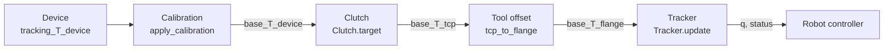

# Teleoperation

This page is for wiring a real device (a VR controller, a SpaceMouse, a mocap
marker, a transform gizmo) to an arm through ssik. It explains how to put the
parts together and what to decide along the way. The contracts (formulas,
statuses, thresholds, input rules) are in the API reference, under
[Streaming IK: `Tracker`](api.md#streaming-ik-tracker) and
[Teleoperation frames: `ssik.teleop`](api.md#teleoperation-frames-ssikteleop),
and this page links there rather than restating them.
[`examples/06_teleop.py`](https://github.com/personalrobotics/ssik/blob/main/examples/06_teleop.py)
runs the whole pipeline headless with a scripted device.

## The pipeline



```python
import ssik
from ssik.teleop import Clutch, apply_calibration, flange_to_tcp, tcp_to_flange

arm = ssik.Manipulator.from_prebuilt("panda")
tracker = arm.tracker(q_measured, max_joint_speed=1.5)
clutch = Clutch(scale=0.5)                       # frame="world" by default

for T_device, t in device.poses():               # any PoseSource
    D = apply_calibration(calibration, T_device)  # into the arm's base frame
    if grip_pressed() and not clutch.engaged:
        clutch.engage(D, flange_to_tcp(arm.fk(tracker.q), tool))
    elif not grip_pressed():
        clutch.release()
    T_tcp = clutch.target(D)                     # None while released
    if T_tcp is not None:
        step = tracker.update(tcp_to_flange(T_tcp, tool), t)
    robot.command(tracker.q)                     # every tick, whatever happened
```

ssik ships no device code. A device is anything with a `poses()` method that
yields `(T, t)` pairs, the `PoseSource` protocol.

## Units and conventions

- Poses are 4x4 rigid transforms with positions in **metres**. `a_T_b` is the
  pose of frame `b` in frame `a`, and frames compose as
  `a_T_c = a_T_b @ b_T_c`. A device that reports millimetres or a
  quaternion has to be converted first.
- Joint angles are in radians. `max_joint_speed` is in **rad/s**, or **m/s**
  for a prismatic joint, and `jump_threshold` is in radians.
- Timestamps are in seconds and must never decrease. Use the device's own
  timestamps or `time.monotonic()`, never the wall clock, which can step
  backwards.
- Every pose is checked as `solve()` checks its target
  ([Input validation](api.md#input-validation)): a matrix that is not a rigid
  transform raises an error rather than being silently repaired.

## Calibration

### Three frames

A device reports poses in its own fixed frame, the **tracking frame**: the
base station of a VR system, the origin a mocap system was calibrated to.
`apply_calibration` needs `base_T_tracking`, the tracking frame in the arm's
base frame.

On a single arm on a table, the base frame is often the only robot frame, and
`base_T_tracking` is measured directly (see
[Measuring it](#measuring-it-with-calibration_from) below). Arms mounted on a
torso or a mobile base, such as a bimanual robot with one arm at each shoulder,
usually also have a **world frame** aligned with the room, and each arm's base
sits somewhere in it, tilted. The calibration is then a composition of two
transforms that come from different places:

```python
from ssik.teleop import invert

# world_T_tracking: where the tracking system is in the room (device setup).
# world_T_base:     where this arm is mounted (robot description or mounting).
base_T_tracking = invert(world_T_base) @ world_T_tracking
```

Do not pass `world_T_tracking` alone, or `invert(world_T_base)` alone, as the
calibration. Either is correct only when the frame it skips coincides with
the world frame. Otherwise a hand moving forward drives the tool in a rotated
direction.

### Measuring it with `calibration_from`

When `world_T_tracking` is not known, measure the calibration by pairing a
device reading with a robot pose:

1. Move the arm to a known configuration `q` that leaves room around the tool,
   and compute the TCP pose there: `T_robot = flange_to_tcp(arm.fk(q), tool)`
   (`base_T_tcp`).
2. Hold the device rigidly at the TCP with its axes on the tool's axes, for
   example in a fixture in the gripper. If the device sits at a known offset
   `tcp_T_device` instead, use `T_robot @ tcp_T_device` as the robot pose in
   the next steps.
3. Read the device: `T_device` (`tracking_T_device`). Average several samples
   if the reading is noisy.
4. Compute `calibration = calibration_from(T_device, T_robot)`. This is
   `base_T_tracking`, and `apply_calibration(calibration, T_device)` returns
   `T_robot`.
5. Check it at a second pose: move the arm, hold the device at the TCP again,
   and compare `apply_calibration(calibration, reading)` with the new TCP pose.
   The difference is your calibration error.
6. On a mounted arm, keep `world_T_tracking = world_T_base @ calibration`. It
   does not depend on the arm, so the other arm of a bimanual robot reuses it.

How much of the calibration matters depends on the clutch mode. The clutch
only uses device motion relative to the anchor, so with `frame="world"` only
the calibration's **rotation** has any effect, and with `frame="tool"` the
calibration has no effect at all. Both follow from the clutch formulas in the
[API reference](api.md#teleoperation-frames-ssikteleop). A rough translation
is harmless. A wrong rotation turns every motion in `frame="world"`.

### Why `frame="world"` moves the tool in the room

Both clutch modes commute with a rigid change of frame
([API reference](api.md#teleoperation-frames-ssikteleop)): clutching in the base
frame after calibration gives the same physical target as clutching in the
world frame. So with a correct calibration, moving the hand 10 cm along the
room's +x moves the tool `scale * 10` cm along the room's +x, however the arm
is mounted. `tests/test_teleop.py` checks this with a tilted, offset mount.

### Bimanual setups

Give each arm its own calibration, `Clutch` and `Tracker`, all sharing one
`world_T_tracking`:

```python
sides = ("left", "right")
arm = {s: ssik.Manipulator.from_prebuilt("panda") for s in sides}
calibration = {s: invert(world_T_base[s]) @ world_T_tracking for s in sides}
clutch = {s: Clutch(scale=0.5) for s in sides}
tracker = {s: arm[s].tracker(q_measured[s], max_joint_speed=1.5) for s in sides}
```

Each hand's readings go through its own arm's calibration, clutch and tracker.

The two arms are independent: one can be `HELD` while the other tracks. ssik
does not check for collisions between them (see [Safety](#safety)).

## Choosing the clutch frame

`Clutch(frame="world")` (the default) applies the device's motion in the
room's directions, and turns the tool about its own point. Use it for a
hand-held device that the operator moves while watching the arm: a VR
controller, a mocap marker, an on-screen gizmo.

`Clutch(frame="tool")` applies the device's motion along the tool's own axes,
as they were when the grip was pressed. Use it for jogging along the tool's
axes, such as a SpaceMouse held like the tool: pushing the cap forward moves
the tool along its approach axis.

For both:

- `scale` (default `1.0`) scales translation only. `0.5` makes 1 m of hand
  motion 0.5 m of tool motion, for fine work. Rotation is never scaled.
- Releasing the grip and pressing it again re-anchors, so the operator can
  move the device back to a comfortable spot without moving the arm.
- Engage with the arm's current pose, `flange_to_tcp(arm.fk(tracker.q), tool)`,
  rather than the last target. The arm may still be catching up after a
  `LIMITED` stretch, and engaging there keeps the target from jumping.

## Choosing `max_joint_speed` and `jump_threshold`

**`max_joint_speed`** bounds how fast the arm follows: no joint moves more than
`max_joint_speed * dt` per update. Pass one number, or one per joint. Set it at
or below what your robot controller accepts, per joint, with margin for your
control rate. Small values feel sluggish, since the arm lags a fast hand
(`LIMITED`), but they also smooth out tracking glitches. The limit applies only
to updates that carry a timestamp after an earlier one: an update without `t`
is not rate limited. A second call with the same timestamp has `dt = 0` and
does not move the arm.

**`jump_threshold`** (default `0.5` rad) decides what counts as the same branch.
It does not depend on time. A candidate further than this from the branch
being followed is a branch switch: an elbow or wrist flip. Keep it well above
the largest joint move a legitimate motion makes between two updates, which
is small at teleoperation rates: at 100 Hz and 2 rad/s it is 0.02 rad. Lower it
if you see flips get through. Raise it only if your updates are infrequent
compared to the motion. Keep `allow_jump=False` for teleoperation, so that a
flip is never taken without the operator.

## Handling statuses in the control loop

Each update returns a `TrackerStep`. Its `q` is always the configuration to
command (under `HELD` it is the previous one), so command `step.q` (or
`tracker.q`) on every tick, whatever the status. A controller that expects a
setpoint every tick keeps getting the held one. The
[statuses](api.md#streaming-ik-tracker) mean:

| Status | What the loop should do |
|---|---|
| `OK` | Command `q`. |
| `LIMITED` | Command `q`. The arm is lagging the target, by `step.lag`. Show it if it persists, since the operator is moving faster than the arm will. |
| `HELD` | Command `q`, which is the previous one. Tell the operator why, from `step.reason`: `"unreachable"` (out of reach), `"limits"` (a joint limit is in the way) or `"jump"` (continuing needs a branch switch). |
| `JUMPED` | Only with `allow_jump=True` or after `next_branch()`. The arm makes a large move, rate limited. Ask the operator first. |

While held, the tracker keeps following its branch and resumes `OK` when the
target comes back within that branch's reach. Usually the operator brings the
hand back. Releasing and re-engaging the clutch also works: it re-anchors at
the arm's pose, so the next target is next to it.

On `HELD` with reason `"jump"`, the target is reachable, but only on another
branch. `tracker.solutions()` lists the branches at the last accepted target,
for display, and `tracker.next_branch()` switches to the next one when the
operator asks.

Call `tracker.reset(q_measured, t=t)` whenever the arm moved without the
tracker: after another controller, hand guiding, or an emergency stop. Then
release the clutch, so the next grip anchors at the arm's real pose.

## Elbow control on 7-DOF arms

On the Franka Panda, FR3, KUKA iiwa and the other arms with a closed-form
self-motion chart, the tracker can swing the elbow while the hand stays on the
target. See the Self-motion paragraphs of
[Streaming IK](api.md#streaming-ik-tracker) for the contract.

```python
red = tracker.redundancy              # None if the arm has no chart
if red is not None:
    lo, hi = red.arc                  # the range a slide can cover
    value = min(max(red.t + stick * rate * dt, lo), hi)
    step = tracker.set_redundancy(value, t)
```

- Map a second input, such as a thumbstick or a slider, to the coordinate
  `red.t`. That coordinate is the joint `q6` on the Panda and FR3 and the
  swivel angle on SRS arms such as the iiwa (`red.parameter` says which).
- `red.arc` is the stretch the elbow can slide without leaving the branch or
  crossing a joint limit. Clamp the input to it. A value past an end returns
  `HELD`.
- Later `update()` calls keep the chosen coordinate as the hand moves, as
  long as that stays possible.
- Use one call per tick: `set_redundancy` while the elbow input moves,
  `update` otherwise. Both take timestamps, and the rate limit applies to
  both.
- Arms on `seven_r.srs_polished` (Kinova Gen3, Kinova JACO j2s7s300, RealMan
  RM75, ABB YuMi) have no chart yet: `redundancy` is `None` and `set_redundancy` raises
  `NotImplementedError`. Check `redundancy` before offering the control.
  [#701](https://github.com/personalrobotics/ssik/issues/701) tracks support.

`examples/05_viser_interactive_ik.py` has an elbow slider built this way.

## Per-update cost

Measured on an Apple M1 Max (macOS 26.6, Python 3.13), one `Tracker.update`
per step along a smooth 100 Hz path, median per update:

| Arm | Solver | Native | Python |
|---|---|---|---|
| UR5e | `ikgeo.three_parallel` | 0.04 ms | 0.7 ms |
| Kinova Gen3 | `seven_r.srs_polished` | 0.05 ms | 0.2 ms |
| KUKA iiwa14 | `seven_r.srs` | 0.13 ms | 1.7 ms |
| Franka Panda | `seven_r.spherical_shoulder` | 0.5 ms | 23 ms |

With the native extension (the default when it is installed) the median update
fits a 1 kHz loop on all four arms. The pure-Python fallback on the Panda does
not fit a 50 Hz one. A `HELD` update can cost more than a tracking one, since the
tracker works out why: an unreachable target costs 3.4 ms native on the Panda.
`set_redundancy` steps cost about 0.1 ms native on the Panda and the iiwa.
Measure on your own machine and arm before you budget a control loop.

## Threading

A `Tracker` is not thread-safe ([Streaming IK](api.md#streaming-ik-tracker)):
every call reads and changes its state. Give each
tracker exactly one writer, normally the control loop. If a device reader
or a UI runs on another thread, have it hand poses or slider values to the
control loop through a queue or a "latest value" slot, rather than calling the
tracker itself. A `Clutch` holds state too, so the same applies to it. Separate
trackers, for example one per arm, are independent.

## Safety

`HELD` and `max_joint_speed` are not a safety system. ssik computes joint
configurations, and nothing more:

- there are no acceleration or jerk limits, so a `LIMITED` stretch can still
  start and stop abruptly;
- there is no collision or self-collision checking, with the environment, the
  robot's own body, or another arm;
- there is no watchdog. If the device stream stops, the tracker is never
  called again and the last command stands. Detect a stale stream yourself.

Run teleoperation through a robot controller with its own safety layer:
velocity, acceleration and torque limits, collision detection, and a
supervised stop.
